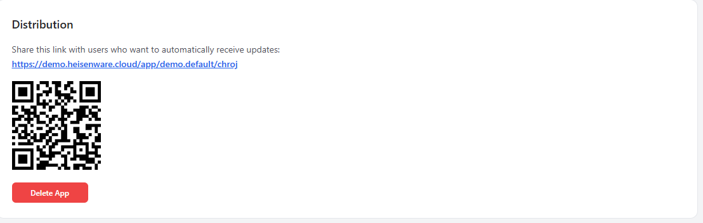

# Overview

The App Manager is the administrative center of your Heisenware account. It's where you create new Apps, monitor Account usage, and manage your Members.

<figure><figcaption></figcaption></figure>

## Key features

The App Manager is divided into four primary functional areas:

* [**App Management**](overview.md#app-management): The default landing page where you create, configure, and deploy Apps. From here, you can also [manage App access and your Users](access-and-user-management.md).
* [**Dashboard**](overview.md#dashboard): A real-time summary of account-wide performance and User metrics.
* [**Members**](members.md): The interface for inviting and managing your Members.
* [**Inbound Integrations**](integrations-inbound-connections.md): Monitoring and authorizing data from [Agents](../app-builder/build-backend/function-explorer/agents/README.md), MQTT, and VRPC clients.

## App management

Manage Apps, their settings, and Users inside the Apps panel.

### Create a new App



#### Initialize

Click the plus icon in the top bar to create a new App container.

<figure><figcaption></figcaption></figure>



#### Configure

Enter a name and description, upload an icon, and define your initial [Users and Access](access-and-user-management.md) settings.

<figure><figcaption></figcaption></figure>



#### Start building

Click Start App Builder on the App card to open the development environment in a new tab.

<figure><figcaption></figcaption></figure>




The total number of Apps you can create depends on your plan. [Contact us](mailto:support@heisenware.com) if you need additional Apps for your plan.


### App settings

* **Name**: The visible title on desktops, home screens, and browser tabs. Keep this under 10 characters for the best mobile display.
* **Description**: Optional internal notes. These are not visible to Users.
* **Icon**: The logo used for the favicon and home screen icon. Works best as a square image. Leave padding around the logo, since mobile devices often apply a circular cutout.
* **Language (Beta)**: Heisenware can automatically translate your App using AI. Supported reference languages include English, German, French, Turkish, Italian, and Spanish. [Contact us](mailto:support@heisenware.com) for access to this feature.

### App status and control

Each App card displays its current availability:

* <mark style="background-color:green;">**RUNNING**</mark>: The App is live and reachable via its URL.
* <mark style="background-color:orange;">**EXITED**</mark>: The App has been manually stopped.
* **CREATED**: The App container exists but has never been deployed.
* <mark style="background-color:red;">**UNAVAILABLE**</mark>: An error has occurred. Try to redeploy.

### Delete an App

Click the red Delete App button to remove an App. This action is irreversible. Always save a [Tag](../app-builder/deploy-and-maintain.md#versioning-tags-snapshots) (`.hwt` file) from the App Builder before deleting if you want to preserve your work.

<figure><figcaption></figcaption></figure>

### Distribution

Apps are distributed via a unique URL or a QR code. Both are found directly on the App card in the Apps panel.

<figure><figcaption></figcaption></figure>

### Maintenance

To take an App offline, use the Action Switch on the card to toggle between Run and Stop.

<figure><figcaption></figcaption></figure>

## Dashboard

The Dashboard panel provides a real-time summary of your Account's performance, including usage stats like total App views and unique Users across all Apps.
