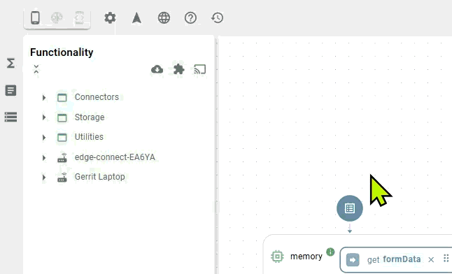

# Add-ons

An add-on brings new classes to the platform. It is a standard Docker image that the platform loads and runs; its functions then appear in the Functions explorer like any others.


#### Add-ons and extensions

Add-ons add whole new classes. Extensions are something else: the modifiers, filters, recorders and error handlers that sit on an executor's output. See [Extensions, branching and errors](../../../concepts/extensions-branching-and-errors.md).


There are two kinds of add-ons:

* **Official add-ons**, built and maintained by Heisenware.
* **Custom add-ons**, Docker images you build yourself around your own algorithms, drivers or logic.

## Official add-ons

<table><thead><tr><th width="220">Add-on</th><th>Description</th></tr></thead><tbody><tr><td><a href="industrial-blockchain.md">Industrial Blockchain</a></td><td>Immutable data logging and audit trails.</td></tr></tbody></table>

Once installed, an add-on runs next to the platform's own services, and its functions appear in the Functions explorer.

<figure><figcaption>Adding an add-on in the App Builder</figcaption></figure>

## Custom add-ons

Wrap your code in a Code Adapter, then load the image into the platform or run it on your own infrastructure. [Custom add-ons](../../../developers/custom-add-ons.md) shows the steps.
