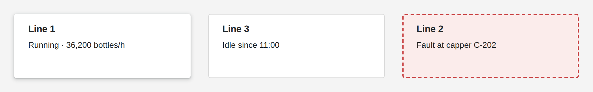

# Card

<figure><figcaption></figcaption></figure>

A card is a surface behind other widgets that groups them into one panel. It can lift off the page with a shadow or sit flat with an outline, and it takes any background color, border and corner radius. Your logic can change its look while the App runs, for example to turn a line's card red while that line is in fault.

**Good for:** panels and tiles on dashboards, framing groups of inputs, highlighting alarms.

<!-- generated -->
<!-- Source: heisenware-cloud/packages/widgets/card. Regenerate with scripts/reference/widgets.mjs; edit outside this block only. -->

## Properties

The widget's General tab lists these properties under Receives and Emits. Drop an executor's output, input or trigger onto a row to link it. An example also fills an unlinked widget as demo data in the App Builder.



**`variant`** (from an output, `'elevation' | 'outlined'`): The global appearance of the card.

<details>

<summary>Example</summary>

```json
"outlined"
```

</details>

**`backgroundColor`** (from an output, `string`): Any valid CSS color defining the background.

<details>

<summary>Example</summary>

```json
"#f5f7fa"
```

</details>

**`opacity`** (from an output, `number`): Transparency from 0 (transparent) to 1 (opaque)

<details>

<summary>Example</summary>

```json
0.9
```

</details>

**`borderRadius`** (from an output, `string | number`): Any valid CSS identifier to define the border radius.

<details>

<summary>Example</summary>

```json
12
```

</details>

**`border`** (from an output, `object`): An object, defining the border.

<details>

<summary>Example</summary>

```json
{
  "width": 1,
  "color": "#62a378",
  "style": "dashed"
}
```

</details>

**`elevation`** (from an output, `'theme' | 'flat' | 'low' | 'medium' | 'high'`): The visual height above the background.

<details>

<summary>Example</summary>

```json
"medium"
```

</details>

**`style`** (from an output, `object`): Arbitrary CSS key / value instructions.

<details>

<summary>Example</summary>

```json
{
  "padding": "8px"
}
```

</details>

**`props`** (from an output, `object`): Facilitates setting several properties at once.

<details>

<summary>Example</summary>

```json
{
  "backgroundColor": "#ffffff",
  "opacity": 1
}
```

</details>





## Settings

Double-click the widget in the Page editor to open its settings, grouped in these tabs.

<details>

<summary>Look &amp; feel</summary>

* **Surface style**: Elevation raises the card with a shadow (see elevation); outlined draws a border instead (see border). Choices: `elevation`, `outlined`.
* **Background color**: Fill color of the card as a CSS color; auto or empty keeps the theme's tile color.
* **Opacity**: Transparency of the whole card from 0 (invisible) to 1 (solid). Range 0 to 1.
* **Corner radius**: Rounding of the corners, from square to circle; theme keeps the theme's radius. Choices: Theme, Square, Low, Medium, High, Circle.
* **Custom CSS overrides**: Raw CSS properties applied to the card.
  * **Property**: CSS property in camelCase, e.g. zIndex or cursor.
  * **Value**: Value of that property, e.g. 100 or pointer.
* **Elevation**: Shadow depth under the card, from flat (none) to high; theme keeps the theme's shadow. Choices: Theme, Flat, Low, Medium, High. Only when Surface style is `elevation`.
* **Border**: Line drawn around an outlined card. Only when Surface style is `outlined`.
  * **Width**: Line width in px. Only when Surface style is `outlined`.
  * **Color**: Line color; auto or empty keeps the theme's border color. Only when Surface style is `outlined`.
  * **Style**: Solid, dashed or dotted line. Choices: `solid`, `dashed`, `dotted`. Only when Surface style is `outlined`.

</details>

<!-- /generated -->
