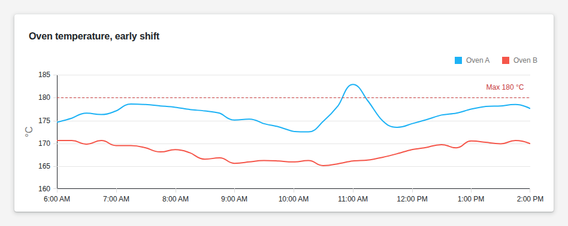
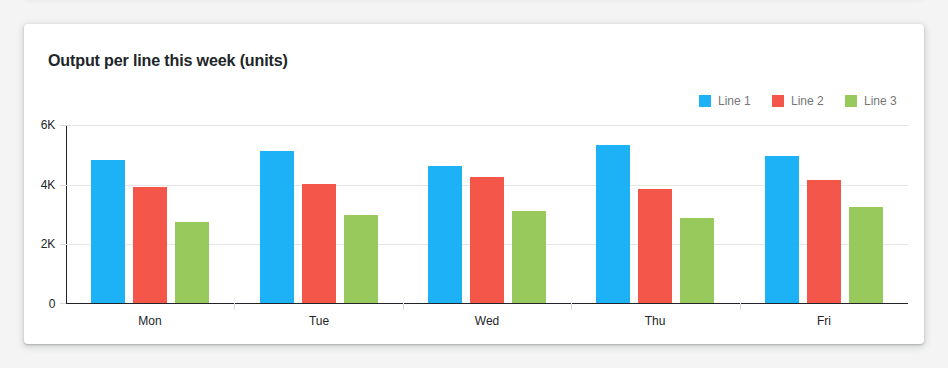

# Chart

<figure><figcaption></figcaption></figure>

<figure><figcaption></figcaption></figure>

A chart draws rows of data as lines, areas, bars, points or bubbles: over time, or across categories such as lines, shifts or products. One chart holds several series, stacked panes and more than one value axis. Constant lines mark targets and limits, and they can come from your logic, so a limit changes with the product. Users hover for exact values, and zoom and pan through long time ranges; aggregation keeps a dense series readable.

**Good for:** sensor trends against limits, output and OEE comparisons, energy and consumption over time.

<!-- generated -->
<!-- Source: heisenware-cloud/packages/widgets/chart. Regenerate with scripts/reference/widgets.mjs; edit outside this block only. -->

## Properties

The widget's General tab lists these properties. Drop an executor's output, input or trigger onto a row to link it.

### Receives

| Property | Linked to | Value | What it does |
|---|---|---|---|
| `data` | output | `Array<object>` | The data source for charts. Use an array of objects. Each object must be of identical structure/schema, but may contain multiple properties allowing to plot multiple series in one chart. |
| `constantLines` | output | `Array<object>` | Allows to define constant lines for indicating e.g. max, min, ave and the like. |

### Example values

The same values fill an unlinked widget as demo data in the App Builder.

<details>

<summary><code>data</code></summary>

```json
[
  {
    "timestamp": "2026-08-12T10:00:00Z",
    "pressure": 2.4,
    "temperature": 61.3
  },
  {
    "timestamp": "2026-08-12T10:05:00Z",
    "pressure": 2.7,
    "temperature": 62.1
  },
  {
    "timestamp": "2026-08-12T10:10:00Z",
    "pressure": 2.5,
    "temperature": 61.8
  }
]
```

</details>

<details>

<summary><code>constantLines</code></summary>

```json
[
  {
    "value": 3.5,
    "label": "max pressure",
    "color": "#dc2828",
    "dashStyle": "dash",
    "labelHorizontalAlignment": "right"
  }
]
```

</details>

## Settings

Double-click the widget in the Page editor to open its settings. Settings marked *set per screen* are pinned by nature: every screen keeps its own value.

### Series

| Setting | What it does | Default |
|---|---|---|
| Argument field | Field whose values run along the argument axis; nested keys join with a hyphen (sensor-temp). |  |
| Series data | Series drawn in the chart, each from one value field. |  |
| Series data › Pane | Pane the series is drawn in. Choices: `Main`. | `Main` |
| Series data › Name | Name shown in the legend. |  |
| Series data › Value field | Field that gives the series its values. |  |
| Series data › Type | Drawing style of the series; range types need two range fields, bubble a size field. Choices: Line, Stacked line, Full stacked line, Spline, Stacked spline, Full stacked spline, Step line, Area, Stacked area, Full stacked area, Spline area, Stacked spline area, Full stacked spline area, Step area, Range area, Bar, Stacked bar, Full stacked bar, Range bar, Scatter, Bubble. | Spline |
| Series data › Value axis | Value axis the series is scaled by, named pane-number (Main-1). Choices: `Main-1`. | `Main-1` |
| Series data › Aggregation | Combines the points in each aggregation interval into one value; none plots every point. Choices: None, Average, Minimum, Maximum, Sum. | None |
| Series data › Data points | Shape of the marker drawn at each data point; none draws no markers. Choices: None, Circle, Cross, Polygon, Square, TriangleUp, TriangleDown. | None |
| Series data › Custom color | Color of the series; empty takes the next palette color. |  |
| Series data › Tag field | Field whose value replaces the tooltip of a point; empty shows argument and value. |  |
| Series data › Ignore empty points | Connects the series across missing values instead of leaving a gap. | off |
| Series data › Range value 1 | Field for one end of the range in a range area or range bar series. Only when Type is Range area. |  |
| Series data › Range value 2 | Field for the other end of the range in a range area or range bar series. Only when Type is Range area. |  |
| Series data › Size field | Field that sets the bubble size in a bubble series. Only when Type is Bubble. |  |

### X-axis

| Setting | What it does | Default |
|---|---|---|
| Title | Title shown along the argument axis; empty shows none. |  |
| Argument type | How argument values are read: numeric as numbers, datetime as dates, string as discrete categories. Choices: `numeric`, `datetime`, `string`. | `numeric` |
| Width | Thickness of the axis line in px. Range 1 to 8. | `1` |
| Color | Color of the axis line; auto keeps the theme's. | automatic |
| Visible | Draws the argument axis line. | on |
| End on tick | Ends the axis on a major tick instead of at the data edge. | off |
| Inverted | Reverses the axis direction. | off |
| Tick interval unit | Unit of the spacing between major ticks on a date-time axis; empty lets the chart choose. Choices: Millisecond, Second, Minute, Hour, Day, Week, Month, Quarter, Year. |  |
| Tick interval | Number of units between major ticks; takes effect only with a tick interval unit. | `1` |
| Aggregation unit | Unit of the time bucket that series aggregation combines points into; empty sizes buckets by pixel width. Choices: Millisecond, Second, Minute, Hour, Day, Week, Month, Quarter, Year. |  |
| Aggregation interval | Number of units per aggregation bucket; takes effect only with an aggregation unit. | `1` |
| Label › Visible | Shows the argument labels along the axis. *Set per screen.* | on |
| Label › Display mode | Layout of labels that would overlap: one row, staggered across two rows, or rotated; horizontal axes only. Choices: Standard, Stagger, Rotate. | Standard |
| Label › Indent from axis | Gap between the axis line and its labels in px. Range 4 to 40. | `10` |
| Label › Position | Draws the labels inside the plot area or outside it. Choices: Inside, Outside. | Outside |
| Label › Format | Date or number format of the label text; auto shows the value as is. Choices: Auto, Millisecond, Second, Minute, Hour, Day, Day of week, Month, Month and day, Month and year, Quarter, Quarter and year, Year, Short time, Long time, Short date, Long date, Short date short time, Long date long time, Thousands, Millions, Billions, Trillions, Currency, Decimal, Exponential, Fixed point, Large number, Percent. | Auto |
| Label › Size | Font size of the labels in px. Range 6 to 48. *Set per screen.* | `12` |
| Label › Weight | Font weight of the labels, 100 (thin) to 900 (black). Range 100 to 900. | `400` |
| Label › Color | Color of the labels; auto keeps the theme's. | automatic |
| Grid & ticks › Major grid visible | Draws a grid line at every major tick. | off |
| Grid & ticks › Major grid color | Color of the major grid lines; auto keeps the theme's. | `#d3d3d3` |
| Grid & ticks › Minor grid visible | Draws grid lines between the major ticks. | off |
| Grid & ticks › Minor grid color | Color of the minor grid lines; auto keeps the theme's. | `#d3d3d3` |
| Grid & ticks › Major tick visible | Draws tick marks at the major ticks. | on |
| Grid & ticks › Major tick color | Color of the major tick marks; auto keeps the theme's. | automatic |
| Grid & ticks › Minor tick visible | Draws smaller tick marks between the major ones. | off |
| Grid & ticks › Minor tick color | Color of the minor tick marks; auto keeps the theme's. | automatic |

### Y-axes

| Setting | What it does | Default |
|---|---|---|
| Panes | Stacked plot areas that share the argument axis; each holds its own value axes. |  |
| Panes › Name | Name of the pane; series and axis names refer to it. | `New Pane` |
| Panes › Height | Height of the pane in px (its width on a rotated plot); empty shares the space left. Range 10 to 1000. |  |
| Panes › Background color | Background color of the pane behind its series. |  |
| Panes › Value axes | Value axes drawn in the pane; a series picks one as pane-1, pane-2 in this order. |  |
| Panes › Value axes › Title | Title shown along the axis; empty shows none. |  |
| Panes › Value axes › position | Side of the pane the axis is drawn on; top and bottom apply to a rotated plot. Choices: `left`, `right`, `top`, `bottom`. | `left` |
| Panes › Value axes › Width | Thickness of the axis line in px. Range 1 to 8. | `1` |
| Panes › Value axes › Color | Color of the axis line; auto keeps the theme's. | automatic |
| Panes › Value axes › Start value | Lowest value shown on the axis; empty fits the data. |  |
| Panes › Value axes › End value | Highest value shown on the axis; empty fits the data. |  |
| Panes › Value axes › Visible | Draws the value axis line. | on |
| Panes › Value axes › End on tick | Ends the axis on a major tick instead of at the data edge (always on while scaling to constant lines). | on |
| Panes › Value axes › Inverted | Reverses the axis direction. | off |
| Panes › Value axes › Label › Visible | Shows the value labels along the axis. | on |
| Panes › Value axes › Label › Display mode | Layout of labels that would overlap: one row, staggered across two rows, or rotated; horizontal axes only. Choices: Standard, Stagger, Rotate. | Standard |
| Panes › Value axes › Label › Indent from axis | Gap between the axis line and its labels in px. Range 4 to 40. | `10` |
| Panes › Value axes › Label › Position | Draws the labels inside the plot area or outside it. Choices: Inside, Outside. | Outside |
| Panes › Value axes › Label › Format | Date or number format of the label text; auto shows the value as is. Choices: Auto, Day, Month, Quarter, Year, Billions, Currency, Decimal, Exponential, FixedPoint, Large number, Long date, Long time, Millions, Millisecond, Month and day, Month and year, Percent, Quarter and year, Short date, Short time, Thousands, Trillions, Day of week, Hour, Long date and time, Minute, Second, Short date and time. | Auto |
| Panes › Value axes › Label › Size | Font size of the labels in px. Range 6 to 48. | `12` |
| Panes › Value axes › Label › Weight | Font weight of the labels, 100 (thin) to 900 (black). Range 100 to 900. | `400` |
| Panes › Value axes › Label › Color | Color of the labels; auto keeps the theme's. | automatic |
| Panes › Value axes › Constant lines | Marker lines drawn across the plot at fixed values of this axis. |  |
| Panes › Value axes › Constant lines › Value | Axis value the line is drawn at. |  |
| Panes › Value axes › Constant lines › Label | Text shown next to the line; empty shows no label. |  |
| Panes › Value axes › Constant lines › Width | Thickness of the line in px. Range 1 to 16. | `1` |
| Panes › Value axes › Constant lines › Dash style | Stroke pattern of the line. Choices: Solid, Dash, Long dash, Dot. | Solid |
| Panes › Value axes › Constant lines › Color | Color of the line and its label text. | `#000000` |
| Panes › Value axes › Constant lines › Display behind series | Draws the line under the series instead of on top. | off |
| Panes › Value axes › Constant lines › Label position | Where the label sits relative to the plot area. Choices: Inside the plot, Outside, at the axis. | Inside the plot |
| Panes › Value axes › Constant lines › Label horizontal alignment | Horizontal placement of the label along the line. Choices: Left, Center (inside only), Right. | Left |
| Panes › Value axes › Constant lines › Label vertical alignment (inside only) | Puts the label above or below the line when it sits inside the plot. Choices: Above the line, Below the line. | Above the line |
| Panes › Value axes › Grid & ticks › Major grid visible | Draws a grid line at every major tick. | off |
| Panes › Value axes › Grid & ticks › Major grid color | Color of the major grid lines; auto keeps the theme's. | `#d3d3d3` |
| Panes › Value axes › Grid & ticks › Minor grid visible | Draws grid lines between the major ticks. | off |
| Panes › Value axes › Grid & ticks › Minor grid color | Color of the minor grid lines; auto keeps the theme's. | `#d3d3d3` |
| Panes › Value axes › Grid & ticks › Major tick visible | Draws tick marks at the major ticks. | on |
| Panes › Value axes › Grid & ticks › Major tick color | Color of the major tick marks; auto keeps the theme's. | automatic |
| Panes › Value axes › Grid & ticks › Minor tick visible | Draws smaller tick marks between the major ones. | off |
| Panes › Value axes › Grid & ticks › Minor tick color | Color of the minor tick marks; auto keeps the theme's. | automatic |

### Legend

| Setting | What it does | Default |
|---|---|---|
| Visible | Shows the legend. *Set per screen.* | on |
| Title | Title shown above the legend items; empty shows none. |  |
| Subtitle | Smaller text under the legend title; empty shows none. |  |
| Vertical alignment | Vertical placement of the legend block in the widget. Choices: Top, Bottom. *Set per screen.* | Top |
| Horizontal alignment | Horizontal placement of the legend block in the widget. Choices: Right, Center, Left. *Set per screen.* | Right |
| Item text position | Side of the color marker the item text sits on; empty picks right for a column, bottom for a row. Choices: Top, Bottom, Left, Right. | Top |
| Position | Draws the legend beside the plot area or overlaid inside it. Choices: Outside, Inside. *Set per screen.* | Outside |
| Orientation | Stacks legend items in a column or lays them in a row; empty picks a row when centered, else a column. Choices: Vertical, Horizontal. *Set per screen.* | Vertical |

### Look & feel

| Setting | What it does | Default |
|---|---|---|
| Zoom and pan | disabled: fixed view; enabled: wheel and pinch zoom, drag pans; selectable: a lock button above the chart turns zoom on and off. Choices: `disabled`, `enabled`, `selectable`. *Set per screen.* | `selectable` |
| Scale to fit constant lines | Extends every value axis to include its constant lines, with 8 % padding so labels never clip. | on |
| Synchronize value axes | Twin axes in one pane share tick positions (grid lines coincide); a range may stretch beyond its data to match. Off: each axis keeps its own range and ticks. | on |
| Show tooltips | Shows a value popup when hovering a point. | on |
| Adjust on zoom | Rescales the value axes to the points visible after a zoom. | on |
| Auto hide point markers | Hides point markers when points get too dense. |  |
| Enable crosshair | Follows the cursor with crosshair lines and axis value labels. *Set per screen.* |  |
| Negatives as zeroes | Plots negative values as zero. |  |
| Rotate plot | Swaps the axes: arguments run vertically, values horizontally. *Set per screen.* |  |
| Disabled | Ignores all user interaction (zoom, pan, hover, selection). |  |
| Bar group padding | Gap between neighboring bar groups as a fraction of the group width, 0 to 1; ignored when a group width is set. |  |
| Bar group width | Fixed width of a bar group in px; empty sizes groups from the padding. |  |
| Inner margin | Empty space between the plot and the widget edge in px. | `0` |
| Palette | Colors given to the series in order; empty keeps the default palette. |  |

<!-- /generated -->
