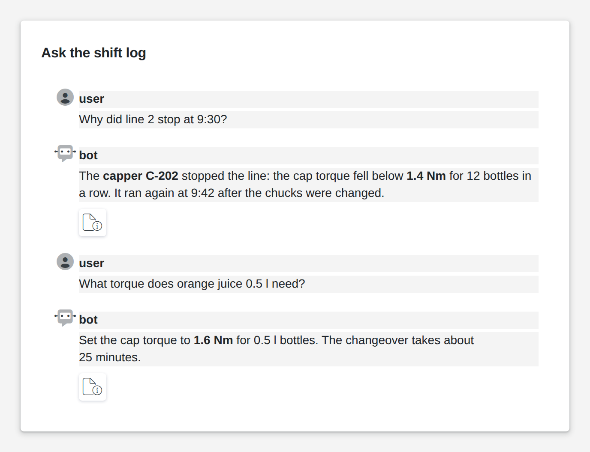

# Chat

<figure><figcaption></figcaption></figure>

A chat shows a conversation between users and a bot, oldest message first. Messages take Markdown, so answers can hold bold words, lists and links, and each answer can list its sources, such as the page of a manual it was taken from. Your logic delivers the conversation, for example from an AI model that answers questions from your shift logs and work instructions, and can clear it again.

**Good for:** assistants that answer from plant documents, support and help desks, message histories.

<!-- generated -->
<!-- Source: heisenware-cloud/packages/widgets/chat. Regenerate with scripts/reference/widgets.mjs; edit outside this block only. -->

## Properties

The widget's General tab lists these properties under Receives and Emits. Drop an executor's output, input or trigger onto a row to link it. An example also fills an unlinked widget as demo data in the App Builder.



**`data`** (from an output, `Array<object>`): The conversation to display, oldest first.

<details>

<summary>Example</summary>

```json
[
  {
    "role": "user",
    "content": "How do I reset the filter?"
  },
  {
    "role": "bot",
    "content": "Open **Settings** and press *Reset*.",
    "sources": [
      {
        "name": "manual.pdf",
        "pageNumber": 12,
        "lineFrom": 3,
        "lineTo": 9
      }
    ]
  }
]
```

</details>

**`clear`** (from an output, `any`): Truthy values clear the conversation.

<details>

<summary>Example</summary>

```json
true
```

</details>





<!-- /generated -->
