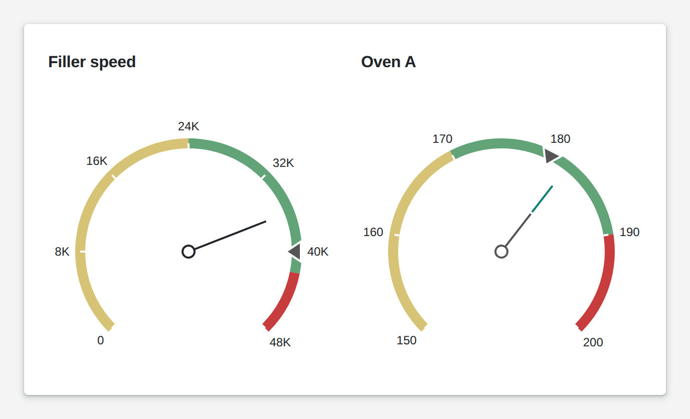

# Circular Gauge

<figure><figcaption></figcaption></figure>

A circular gauge shows a value on a dial, the way an instrument panel does. Colored ranges mark what is good, what needs attention and what is too much; a sub-value adds markers for a target or a setpoint. You pick the needle or marker style, the scale and the arc. Scale and ranges can also come from your logic, so a gauge adapts to the product that runs.

**Good for:** speeds, temperatures and pressures against their limits, machine cockpits, andon boards.

<!-- generated -->
<!-- Source: heisenware-cloud/packages/widgets/circular-gauge. Regenerate with scripts/reference/widgets.mjs; edit outside this block only. -->

## Properties

The widget's General tab lists these properties under Receives and Emits. Drop an executor's output, input or trigger onto a row to link it. An example also fills an unlinked widget as demo data in the App Builder.



**`value`** (from an output, `number`): The main indicator value.

<details>

<summary>Example</summary>

```json
42
```

</details>

**`subValue`** (from an output, `number | Array<number>`): A sub-value or an array of sub-values to visualize next to the value.

<details>

<summary>Example</summary>

```json
[
  30,
  55
]
```

</details>

**`scale`** (from an output, `object`): Settings regarding the value range.

<details>

<summary>Example</summary>

```json
{
  "startValue": 0,
  "endValue": 100
}
```

</details>

**`frame`** (from an output, `object`): Allows you to configure the appearance of the frame.

<details>

<summary>Example</summary>

```json
{
  "startAngle": 225,
  "endAngle": 315,
  "ranges": [
    {
      "startValue": 0,
      "endValue": 60,
      "color": "#19914b"
    },
    {
      "startValue": 60,
      "endValue": 100,
      "color": "#dc2828"
    }
  ]
}
```

</details>





## Settings

Double-click the widget in the Page editor to open its settings, grouped in these tabs.

<details>

<summary>Frame</summary>

* **frame**: The ring around the scale: its angles, thickness, background and colored sections.
  * **Start angle**: Where the scale starts, in degrees: 0 is 9 o'clock, positive turns the start clockwise (upward), negative counter-clockwise. Range -180 to 180.
  * **Circle size**: Length of the arc in degrees, drawn clockwise from the start angle; 360 closes the circle. Range 0 to 360.
  * **Width**: Thickness of the ring in px. Range 1 to 20.
  * **Background color**: Color of the ring where no colored section covers it; empty or auto keeps the theme's.
  * **ranges**: Colored sections of the ring, each from a start value to an end value.
    * **Start value**: Scale value where the section begins.
    * **End value**: Scale value where the section ends.
    * **Color**: Color of the section; empty takes the next color of the gauge's palette.

</details>

<details>

<summary>Indicator</summary>

* **Primary indicator**: The pointer that marks the bound value.
  * **Type**: Shape of the pointer that marks the value on the scale; each shape unlocks its own settings below. Choices: Rectangle needle, Two-Color needle, Triangle needle, Range bar, Triangle marker, Text cloud.
  * **Width**: Width of a needle or triangle marker in px; range bar and text cloud ignore it.
  * **Offset**: Distance between the pointer and the scale line in px; empty keeps the shape's default.
  * **Color**: Color of the pointer; empty or auto keeps the theme's.
  * **Indent from center**: Gap between the center of the gauge and the start of the needle in px; negative extends the needle past the center. Only when Type is Rectangle needle.
  * **Spindle size**: Diameter of the hub disc at the center of the needle in px. Only when Type is Rectangle needle.
  * **Spindle gap size**: Inner diameter of the hub in px, leaving a hole that turns it into a ring. Only when Type is Rectangle needle.
  * **Secondary color**: Color of the needle tip on a two-color needle; empty or auto keeps the theme's. Only when Type is Two-Color needle.
  * **Color fraction**: Share of the needle length painted in the secondary color, from the tip, 0 to 1. Only when Type is Two-Color needle.
  * **Background color**: Color of the bar's track where the bar does not reach; none leaves it transparent. Only when Type is Range bar.
  * **Size**: Thickness of the range bar in px. Only when Type is Range bar.
  * **Base value**: Value the range bar grows from; empty grows it from the start of the scale. Only when Type is Range bar.
  * **Length**: Length of the triangle marker in px, from its base to the tip pointing at the scale. Only when Type is Triangle marker.
  * **Arrow length**: Length of the arrow that joins the text cloud to the scale in px. Only when Type is Text cloud.
* **Subvalue indicator**: The pointer used for every bound sub-value.
  * **Type**: Shape of the pointer that marks the value on the scale; each shape unlocks its own settings below. Choices: Rectangle needle, Two-Color needle, Triangle needle, Range bar, Triangle marker, Text cloud.
  * **Width**: Width of a needle or triangle marker in px; range bar and text cloud ignore it.
  * **Offset**: Distance between the pointer and the scale line in px; empty keeps the shape's default.
  * **Color**: Color of the pointer; empty or auto keeps the theme's.
  * **Indent from center**: Gap between the center of the gauge and the start of the needle in px; negative extends the needle past the center. Only when Type is Rectangle needle.
  * **Spindle size**: Diameter of the hub disc at the center of the needle in px. Only when Type is Rectangle needle.
  * **Spindle gap size**: Inner diameter of the hub in px, leaving a hole that turns it into a ring. Only when Type is Rectangle needle.
  * **Secondary color**: Color of the needle tip on a two-color needle; empty or auto keeps the theme's. Only when Type is Two-Color needle.
  * **Color fraction**: Share of the needle length painted in the secondary color, from the tip, 0 to 1. Only when Type is Two-Color needle.
  * **Background color**: Color of the bar's track where the bar does not reach; none leaves it transparent. Only when Type is Range bar.
  * **Size**: Thickness of the range bar in px. Only when Type is Range bar.
  * **Base value**: Value the range bar grows from; empty grows it from the start of the scale. Only when Type is Range bar.
  * **Length**: Length of the triangle marker in px, from its base to the tip pointing at the scale. Only when Type is Triangle marker.
  * **Arrow length**: Length of the arrow that joins the text cloud to the scale in px. Only when Type is Text cloud.

</details>

<details>

<summary>Scale</summary>

* **Scale**: The value axis of the gauge: its bounds, numbers and tick marks.
  * **Start value**: Value at the start of the scale.
  * **End value**: Value at the end of the scale.
  * **Label**: The numbers written along the scale.
    * **Visible**: Shows the numbers along the scale.
    * **Size**: Font size of the scale numbers in px.
    * **Weight**: Font weight of the scale numbers, 100 (thin) to 900 (black). Range 100 to 900.
    * **Color**: Color of the scale numbers; empty or auto keeps the theme's.
  * **Major tick**: The main tick marks on the scale, one per labeled step.
    * **Visible**: Shows the major tick marks.
    * **Interval**: Distance between major ticks in scale units; empty lets the gauge choose.
    * **Length**: Length of each major tick in px.
  * **Minor tick**: The small tick marks between two major ticks.
    * **Visible**: Shows the minor tick marks.
    * **Interval**: Distance between minor ticks in scale units; empty lets the gauge choose.
    * **Length**: Length of each minor tick in px.

</details>

<!-- /generated -->
