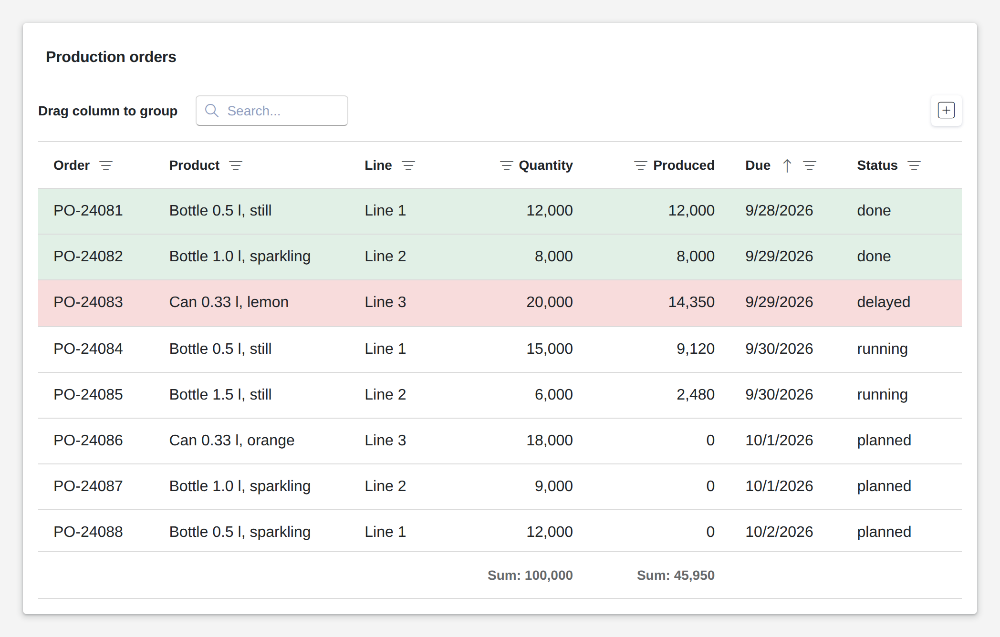

# Data Grid

<figure><figcaption></figcaption></figure>

A data grid shows rows as a table that users work with: they sort and filter by any column, search, group rows by dragging a column header into the group panel, and read totals in the footer. Rules color cells or whole rows by their values. With editing on, users add, change and delete rows, and every change reaches your logic as an event carrying the row. The rows export to PDF, Excel or CSV.

**Good for:** order and stock lists, master data maintenance, logs and reports.

<!-- generated -->
<!-- Source: heisenware-cloud/packages/widgets/data-grid. Regenerate with scripts/reference/widgets.mjs; edit outside this block only. -->

## Properties

The widget's General tab lists these properties under Receives and Emits. Drop an executor's output, input or trigger onto a row to link it. An example also fills an unlinked widget as demo data in the App Builder.



**`data`** (from an output, `Array<any>`): The rows to display. Column configuration is scanned from the first rows at design time and refined via the Content settings; arrays of primitives get generated `index`/`value` columns.

<details>

<summary>Example</summary>

```json
[
  {
    "id": 1,
    "device": "Pump A",
    "pressure": 2.4,
    "status": "running"
  },
  {
    "id": 2,
    "device": "Pump B",
    "pressure": 3.1,
    "status": "idle"
  },
  {
    "id": 3,
    "device": "Compressor",
    "pressure": 5.8,
    "status": "running"
  }
]
```

</details>

**`options`** (from an output, `object`): Provides dropdown and tag options per field at runtime, replacing the statically configured options of that field.

<details>

<summary>Example</summary>

```json
{
  "status": [
    "running",
    "idle",
    [
      "Under maintenance",
      "maintenance"
    ]
  ]
}
```

</details>

**`rowFilter`** (from an output, `object`): Pre-sets the row filter: one entry per column.

<details>

<summary>Example</summary>

```json
{
  "device": "Pump"
}
```

</details>

**`rowFilterOperation`** (from an output, `object`): The comparison operation per row-filtered column, e.g. `contains`, `=`, `>=`.

<details>

<summary>Example</summary>

```json
{
  "device": "contains"
}
```

</details>

**`headerFilter`** (from an output, `object`): Pre-selects header-filter values: one value or an array of values per column.

<details>

<summary>Example</summary>

```json
{
  "status": [
    "running",
    "idle"
  ]
}
```

</details>




**`onInsert`** (into an input, `object`): Writes the newly added row when a user inserts one.

**`onChange`** (into an input, `object`): Writes the edited row when a user saves an update: the whole row merged with the changed fields. In batch mode one event per changed row.

**`onDelete`** (into an input, `string | number`): Writes the removed row's key when a user deletes it: its `id`, or its `index` when the rows carry none.

**`onSelectionChange`** (into an input, `object | Array<object>`): Writes the selection: the selected row in `single` selection mode, an array of rows in `multiple` mode.

**`onRowClick`** (into an input, `object`): Writes the clicked row.

**`onLinkClick`** (into an input, `object`): Writes the clicked row plus `__origin__` (the clicked column's data field) when a column marked *Is Clickable* is clicked.





## Settings

Double-click the widget in the Page editor to open its settings, grouped in these tabs. Settings marked *set per screen* are pinned by nature: every screen keeps its own value.

<details>

<summary>Content</summary>

* **Columns**: Columns of the grid, in display order; scanned from the bound rows at design time.
  * **Data field**: Key of the row field the column shows.
  * **Column name**: Header text of the column; empty derives it from the data field.
  * **Visibility**: visible shows the column, detail moves it into the expandable row detail, hidden hides it but keeps it in the column chooser, removed drops it. Choices: Visible, Detail, Hidden, Removed.
  * **Editing**: optional lets members edit the value, required refuses to save without one, disabled locks the value, hidden leaves it out of the edit form and locks it in place. Choices: Optional, Required, Disabled, Hidden.
  * **Width**: Width of the column in px; empty sizes it to its content (or evenly, with column auto width off).
  * **Pinned**: Pins the column to the left or right edge so it stays while the grid scrolls sideways; the row buttons follow to the right edge. Choices: Not pinned, Left, Right.
  * **Initial sort**: Sorts the rows by this column when the grid opens; members can still re-sort. Choices: None, Ascending, Descending.
  * **Footer summary**: Shows a total for this column in the footer, formatted like the column: sum, average, minimum, maximum or the count of values. Choices: None, Sum, Average, Minimum, Maximum, Count.
  * **Editor widget**: Editor used for the value; also sets the column format (number, date) or preview (media). Choices: Text, Number, Slider, Date/Time, Date range, Calendar, Dropdown, Tags, Checkbox, Switch, Color, Media.
  * **Is clickable**: Shows the cell text as a link; a click emits onLinkClick with the row and __origin__ set to this data field. Only when Editor widget is Text.
  * **Minimum**: Lowest value the editor accepts; empty sets no limit. Only when Editor widget is Number.
  * **Maximum**: Highest value the editor accepts; empty sets no limit. Only when Editor widget is Number.
  * **Default value**: Value a new row starts with in this column. Only when Editor widget is Number.
  * **Precision**: Decimal places shown in the cell and its editor. Only when Editor widget is Number.
  * **Currency**: ISO currency code (EUR, USD) that formats the value as money; empty shows a plain number. Only when Editor widget is Number.
  * **Handle large numbers**: Abbreviates large numbers in the cell (12K, 3M); the editor keeps the full number. Only when Editor widget is Number.
  * **Date type**: Kind of value in the column: a date, a time of day or both; sets the picker and the column type. Choices: Date only, Time only, Date & time. Only when Editor widget is Date/Time.
  * **Format description**: How the display format is chosen: preset picks a named format, explicit composes one from its parts. Choices: Use preset, Explicit. Only when Editor widget is Date/Time.
  * **Discover options**: Adds the values the rows already carry in this column to the options, so every stored value can be picked again. Only when Editor widget is Dropdown.
  * **Options**: Options offered by the dropdown or tag picker, comma separated; label:value shows the label and writes the value. The options output replaces them at runtime. Only when Editor widget is Dropdown.
  * **Switched on text**: Text shown on the switch while it is on. Only when Editor widget is Switch.
  * **Switched off text**: Text shown on the switch while it is off. Only when Editor widget is Switch.
  * **Media type**: File kind of the cell (png, jpeg, svg, pdf); set, the cell shows a preview and loses sorting, filtering, search and export. Choices: `png`, `jpeg`, `svg`, `pdf`. Only when Editor widget is Media.
  * **Is central element**: Shows the media large and full width in the edit form. Only when Editor widget is Media.
  * **Thumbnail size**: Height of the preview in the cell in px. Range 20 to 400. Only when Editor widget is Media.

</details>

<details>

<summary>Look &amp; feel</summary>

* **Appearance**: Layout and styling of the grid.
  * **Paging mode**: virtual loads rows as the member scrolls; standard splits them into pages with a pager below. Choices: Infinite scrolling, Paged view. *Set per screen.*
  * **Detail mode**: How detail columns show under an expanded row: horizontal as a nested table, vertical as a card with labels above values. Choices: Table, Card.
  * **Detail card columns**: Columns for the fields of the detail card: 1 stacks them, auto fits as many as the width allows. Choices: `auto`, `1`, `2`, `3`, `4`, `5`, `6`. *Set per screen.*
  * **Custom content size**: Font size of cell values, filter inputs and editors in px; empty keeps the theme's. Range 6 to 50. *Set per screen.*
  * **Custom label size**: Font size of column headers and popup titles in px; empty keeps the theme's. Range 6 to 50. *Set per screen.*
  * **Show borders**: Draws a border around the grid.
  * **Show headers**: Shows the header row.
  * **Show vertical lines**: Draws lines between columns.
  * **Show horizontal lines**: Draws lines between rows.
  * **Alternate row color**: Shades every second row.
  * **Column auto width**: Sizes each column to its content; off, the columns share the width evenly. *Set per screen.*
  * **Wrap long text**: Wraps cell text onto several lines instead of cutting it off.
  * **Empty text**: Text shown when there are no rows; empty keeps the theme's default.
* **Data display**: What members can do with the rows: select, sort, group, filter, search.
  * **Selection mode**: none, single (click selects one row) or multiple (checkboxes); a change emits onSelectionChange with the row or the rows. Choices: None, Single, Multiple.
  * **Allow column reordering**: Lets members drag column headers to reorder the columns. *Set per screen.*
  * **Allow column resizing**: Lets members drag header edges to resize the columns. *Set per screen.*
  * **Allow column pinning**: Lets members pin columns to the left or right edge from the header menu. *Set per screen.*
  * **Allow column choosing**: Adds a column chooser button to show or hide columns.
  * **Allow multiple column sorting**: Lets members sort by several columns at once; off, sorting one column replaces the previous sort.
  * **Allow grouping**: Shows the group panel, so members drag headers into it to group rows, plus an expand/collapse all button.
  * **Allow searching**: Adds a search box to the toolbar that filters rows by text.
  * **Allow row filtering**: Adds a filter row under the headers with an input per column.
  * **Allow header filtering**: Adds a funnel icon to each header that filters by a searchable list of the column's values.
  * **Allow filter building**: Shows the filter panel below the grid, where members build and edit combined filters.
  * **Show item count**: Shows the row count in a footer under the first visible column.
* **Data editing**: Adding, editing and deleting rows, and what the change events carry.
  * **Mode**: cell saves each cell as it is left, batch collects cell edits until the member saves them all, row edits a whole row inline, form expands the row into a form inside the grid with Save and Cancel under it (give the grid the height for the form, or the member scrolls to the buttons), popup opens a full-screen form. Choices: Cell, Batch, Row, Form, Popup.
  * **Start editing on**: In cell and batch mode: a click or a double click opens the cell editor; double click keeps a click free for selecting the row. Choices: Click, Double click.
  * **Allow adding**: Adds a toolbar button that inserts a row; saving it emits onInsert with the new row.
  * **Allow updating**: Lets members edit rows; saving emits onChange with the whole row and the changes applied.
  * **Allow deleting**: Adds a delete button to each row; deleting emits onDelete with the row's id (or index).
* **Data export**: Export buttons in the toolbar.
  * **Allow PDF export**: Adds a toolbar button that downloads the rows as a PDF; in multiple selection with rows selected, only those.
  * **Allow Excel export**: Adds a toolbar button that downloads the rows as an Excel file; in multiple selection with rows selected, only those.
  * **Allow CSV export**: Adds a toolbar button that downloads the rows as a CSV file; in multiple selection with rows selected, only those.
  * **Hint text**: Label of the export buttons; the format name follows it.
  * **File name**: Name of the downloaded file, without extension.
* **Conditional formatting**: Rules that color cells or whole rows by the value in one column; the first matching rule wins.
  * **Column (data field)**: Data field of the column the rule reads, as listed under Content.
  * **Format rule**: Comparison of the column value with the value to match: text_contains ignores case, text_equals is exact, greater/less compare numbers or dates. Choices: Text contains, Text is equal, Value is greater than, Value is less than.
  * **Apply to whole row**: Colors every cell of the row when the chosen column matches; off colors only that cell.
  * **Background color**: CSS color applied to the matching cells, e.g. green or #ffa500.
  * **Value to match**: Value the column is compared with: text for contains and equals, number or text for greater and less than. Only when Format rule is Text contains, Text is equal, Value is greater than or Value is less than.

</details>

<!-- /generated -->
