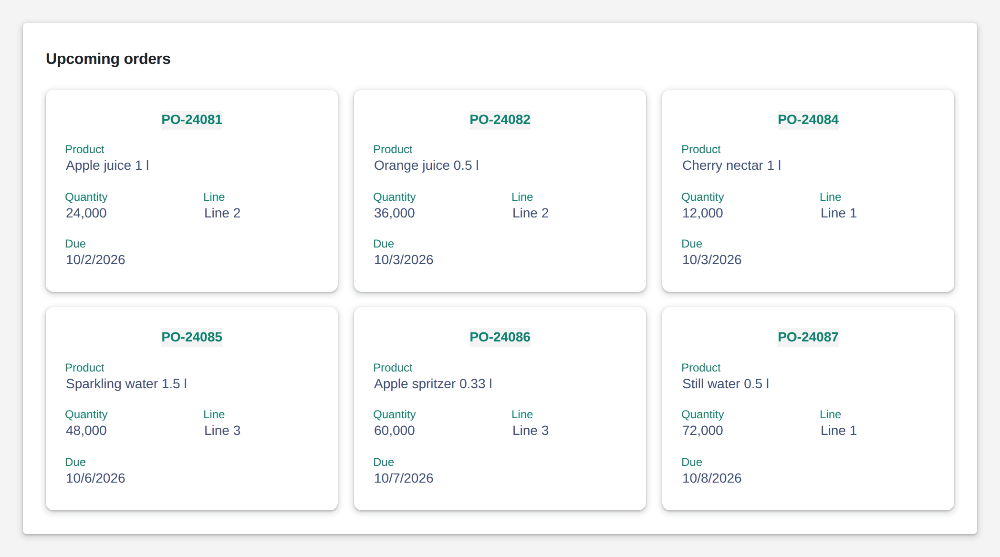

# Data Tiles

<figure><figcaption></figcaption></figure>

Data tiles show records as a wall of cards, one tile per record with a title and its fields. Tiles wrap to fill the width, so the same data fits a wide dashboard and a phone. As with the data list, each field picks its editor, and with editing allowed users change a tile in place and hand the change to your logic.

**Dates** in edited records leave as `2026-10-01` (a date), `08:30:00` (a time of day) or `2026-10-01T06:30:00Z` (date and time, in UTC), the same forms the form writes. A date stored as midnight UTC shows as that day everywhere.

**Good for:** order and job overviews, machine or product cards, touch-friendly boards.

<!-- generated -->
<!-- Source: heisenware-cloud/packages/widgets/data-tiles. Regenerate with scripts/reference/widgets.mjs; edit outside this block only. -->

## Properties

The widget's General tab lists these properties under Receives and Emits. Drop an executor's output, input or trigger onto a row to link it. An example also fills an unlinked widget as demo data in the App Builder.



**`data`** (from an output, `Array<object>`): The items to display, one tile each. Field configuration is scanned from the first items at design time and refined via the Content settings.

<details>

<summary>Example</summary>

```json
[
  {
    "id": 1,
    "device": "Pump A",
    "pressure": 2.4,
    "status": "running"
  },
  {
    "id": 2,
    "device": "Pump B",
    "pressure": 3.1,
    "status": "idle"
  },
  {
    "id": 3,
    "device": "Compressor",
    "pressure": 5.8,
    "status": "running"
  }
]
```

</details>

**`options`** (from an output, `object`): Provides dropdown and tag options per field at runtime, replacing the statically configured options of that field.

<details>

<summary>Example</summary>

```json
{
  "status": [
    "running",
    "idle",
    [
      "Under maintenance",
      "maintenance"
    ]
  ]
}
```

</details>




**`onChange`** (into an input, `object`): Writes the edited tile item after an inline edit.





## Settings

Double-click the widget in the Page editor to open its settings, grouped in these tabs. Settings marked *set per screen* are pinned by nature: every screen keeps its own value.

<details>

<summary>Content</summary>

* **Title field**: Field shown as the tile's heading, above its fields.
* **Data fields**: The fields every tile shows, in this order.
  * **Data field**: Key of the record field.
  * **Label**: Label shown for the field; empty shows the key.
  * **Column span**: Columns the field spans inside the tile (see column count).
  * **Visible**: Shows the field in the tile.
  * **Editor widget**: How the field is shown and edited. Choices: Text, Text area, Number, Slider, Date/Time, Date range, Calendar, Dropdown, Tags, Checkbox, Switch, Color, Media.
  * **Minimum**: Lowest value the editor accepts; empty sets no limit. Only when Editor widget is Number.
  * **Maximum**: Highest value the editor accepts; empty sets no limit. Only when Editor widget is Number.
  * **Precision**: Decimal places shown for the value. Only when Editor widget is Number.
  * **Currency**: ISO currency code (EUR, USD) that formats the value as money; empty shows a plain number. Only when Editor widget is Number.
  * **Handle large numbers**: Abbreviates large numbers (12K, 3M). Only when Editor widget is Number.
  * **Date type**: Kind of value the picker edits: a date, a time of day or both. Choices: Date only, Time only, Date & time. Only when Editor widget is Date/Time.
  * **Format description**: How the display format is chosen: preset picks a named format, explicit composes one from its parts. Choices: Use preset, Explicit. Only when Editor widget is Date/Time.
  * **Discover options**: Adds the values the bound records already carry in this field to the options. Only when Editor widget is Dropdown.
  * **Options**: Options offered by the dropdown or tag picker, comma separated; label:value shows the label and writes the value. The options output of the widget replaces them at runtime. Only when Editor widget is Dropdown.
  * **Switched on text**: Text shown on the switch while it is on. Only when Editor widget is Switch.
  * **Switched off text**: Text shown on the switch while it is off. Only when Editor widget is Switch.
  * **Justification**: Where the preview sits in its field: left, center or right. Choices: Left, Center, Right. Only when Editor widget is Media.
  * **Thumbnail size**: Height of the preview in px. Range 20 to 400. Only when Editor widget is Media.

</details>

<details>

<summary>Look &amp; feel</summary>

* **Appearance**: Layout and typography of the tiles.
  * **Justification**: How a row of tiles is aligned. Tiles fill rows left to right and wrap; left, center and right keep 16 px between tiles, the space variants spread them over the row. Choices: Left, Center, Right, Space between, Space around, Space evenly. *Set per screen.*
  * **Tile width**: Width of one tile in px; empty sizes it to its content. A tile takes this plus 16 px padding plus 16 px spacing, so two 328 px tiles need 720 px or the second wraps. *Set per screen.*
  * **Tile height**: Height of one tile in px; empty sizes it to its content. *Set per screen.*
  * **Column count**: Columns for the fields inside one tile: 1 stacks them, auto fits as many as the tile width allows. Tiles per row follow from the tile width, not from this. Choices: `auto`, `1`, `2`, `3`, `4`, `5`, `6`. *Set per screen.*
  * **Label location**: Where a field's label sits: left of, right of or above its value. Choices: `left`, `right`, `top`. *Set per screen.*
  * **Label mode**: Static: label beside the value. Floating: label inside the editor, rising once it holds a value. Hidden: no label. Outside: label outside the editor box. Choices: Static, Floating, Hidden, Outside. *Set per screen.*
  * **Custom content size**: Font size of the values in px; empty keeps the theme's. Range 6 to 50. *Set per screen.*
  * **Custom label size**: Font size of the labels in px; empty keeps the theme's. Range 6 to 50. *Set per screen.*
  * **Show colon**: Puts a colon after every label.
* **Data handling**: Editing of tile fields and what the change events carry.
  * **Allow updating**: Lets members edit the fields in a tile; every edit emits the change.

</details>

<!-- /generated -->
