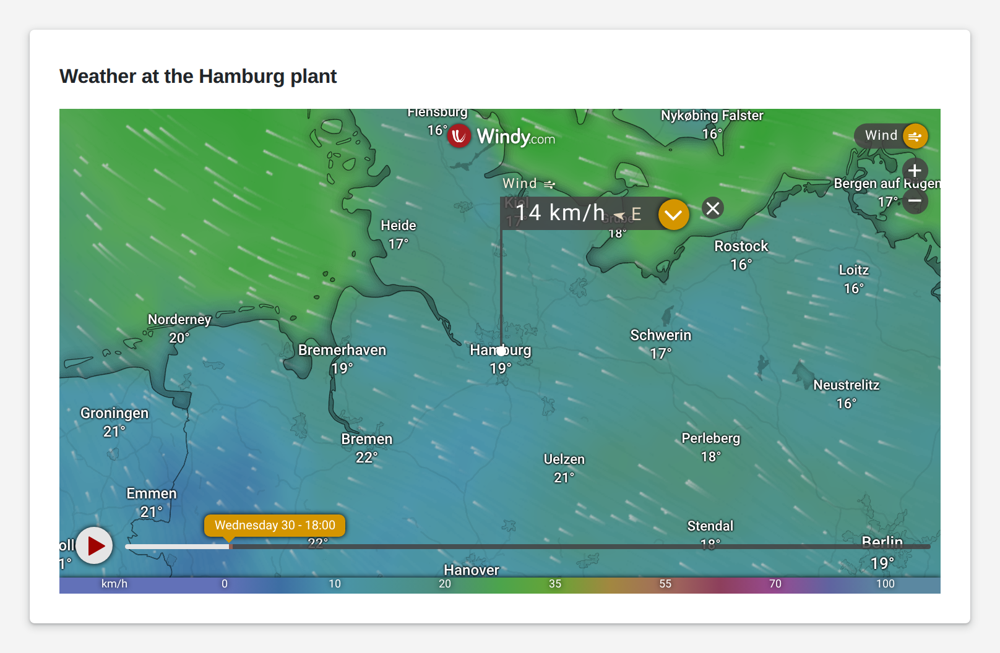

# Iframe

<figure><figcaption></figcaption></figure>

An iframe embeds another web page into your App page: a weather map, a camera stream, a machine's own web interface, a supplier portal or another App. You give it the address and decide whether it shows a border. The embedded page stays what it is; it exchanges no values with your logic. Many websites forbid being embedded; check that the page you want allows it.

**Good for:** machine web interfaces and camera streams, external dashboards, weather and traffic maps.

<!-- generated -->
<!-- Source: heisenware-cloud/packages/widgets/iframe. Regenerate with scripts/reference/widgets.mjs; edit outside this block only. -->

## Settings

Double-click the widget in the Page editor to open its settings, grouped in these tabs.

Look &amp; feel

* **URL**: Address of the page shown inside the frame; must start with http:// or https://, otherwise a hint asks for one.
* **Show border**: Draws a thin grey line around the frame.

<!-- /generated -->
