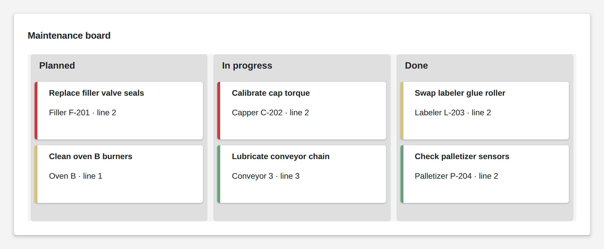

# Kanban

<figure><figcaption></figcaption></figure>

A Kanban board groups cards into columns by their stage. Users drag a card to the next column, and the moved card goes to your logic, which stores the new stage. A status field colors the card's edge, for example by priority. Clicks on a card, its title or a column go to your logic too, for example to open the task's details.

**Good for:** maintenance and repair tasks, order and job tracking, shift handover lists.

<!-- generated -->
<!-- Source: heisenware-cloud/packages/widgets/kanban. Regenerate with scripts/reference/widgets.mjs; edit outside this block only. -->

## Properties

The widget's General tab lists these properties under Receives and Emits. Drop an executor's output, input or trigger onto a row to link it. An example also fills an unlinked widget as demo data in the App Builder.



**`cards`** (from an output, `Array<object>`): The cards to display, grouped into columns by their stage field (`props.stageKey`). At design time the first cards configure the board: stage, title and subtitle keys and the stages (rescan from the canvas menu to redo it).

<details>

<summary>Example</summary>

```json
[
  {
    "id": 1,
    "title": "Check valve",
    "description": "Line 2, weekly",
    "stage": "Not Started"
  },
  {
    "id": 2,
    "title": "Replace filter",
    "description": "Compressor B",
    "stage": "In Progress"
  },
  {
    "id": 3,
    "title": "Calibrate sensor",
    "description": "Tank 4 level",
    "stage": "In Progress"
  },
  {
    "id": 4,
    "title": "Inspect belt",
    "description": "Conveyor 1",
    "stage": "Completed"
  }
]
```

</details>




**`onCardChange`** (into an input, `object`): Writes the moved card (with its stage field updated) after a drag between columns.

**`onColumnClick`** (into an input, `string`): Writes the clicked column's stage value.

**`onCardClick`** (into an input, `object`): Writes the clicked card.

**`onTitleClick`** (into an input, `object`): Writes the card whose title was clicked.





## Settings

Double-click the widget in the Page editor to open its settings, grouped in these tabs.

<details>

<summary>Content</summary>

* **Stage key**: Card field whose value names the stage column the card sits in.
* **Title key**: Card field shown as the card's bold title.
* **Subtitle key**: Card field shown under the title; cards without it show none.
* **Status key**: Card field matched against the status mappings to color the card's left edge.
* **Status mappings**: Status values and the color each gives a card's left edge.
  * **Status**: Value of the status field this mapping applies to, compared as text.
  * **Color**: Color of the card's left edge for this status; auto or empty takes the theme's tile color.

</details>

<details>

<summary>Look &amp; feel</summary>

* **Stages**: Stage names, one column each in this order; dropping a card in a column writes that name to its stage field and emits onCardChange.
* **Card title is clickable**: Renders the title as a link; a click on it emits onTitleClick with the card instead of onCardClick.

</details>

<!-- /generated -->
