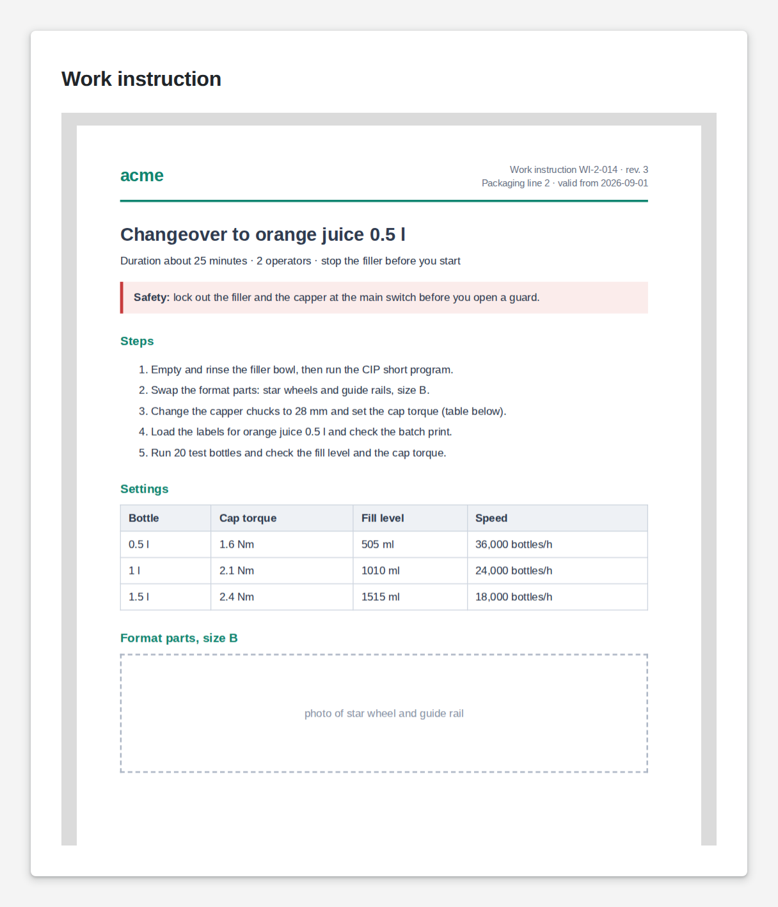

# Media View

<figure><figcaption></figcaption></figure>

A media view shows a document or picture your logic hands it: a PDF, an image or an SVG graphic, from the file server, from an upload or from a web address. Unlike the image widget, it shows whatever arrives while the App runs, so the work instruction can follow the order, and the photo the selected machine.

**Good for:** work instructions and drawings for the current order, photos from uploads, certificates and reports.

<!-- generated -->
<!-- Source: heisenware-cloud/packages/widgets/media-view. Regenerate with scripts/reference/widgets.mjs; edit outside this block only. -->

## Properties

The widget's General tab lists these properties under Receives and Emits. Drop an executor's output, input or trigger onto a row to link it. An example also fills an unlinked widget as demo data in the App Builder.



**`data`** (from an output, `string | object | Array<object>`): The medium to display (pdf, jpeg, png, gif or svg): a file object, a file-server path or a URL. A single-element array is unwrapped.

<details>

<summary>Example</summary>

```json
{
  "name": "report.pdf",
  "type": "application/pdf",
  "path": "/shared/uploads/report.pdf"
}
```

</details>

**`clear`** (from an output, `any`): Truthy values clear the displayed medium.

<details>

<summary>Example</summary>

```json
true
```

</details>





## Settings

Double-click the widget in the Page editor to open its settings, grouped in these tabs. Settings marked *set per screen* are pinned by nature: every screen keeps its own value.

<details>

<summary>Look &amp; feel</summary>

* **Image fitting**: How a picture meets its box when their shapes differ; PDFs ignore it. Choices: Contain (whole image, bars if needed), Cover (fill the box, crop the rest), Fill (stretch to the box), None (natural size, clipped), Scale down (never enlarge). *Set per screen.*
* **Focal point**: Which part of a picture stays visible when the fitting crops it or leaves room. Choices: Center, Top, Bottom, Left, Right, Top left, Top right, Bottom left, Bottom right. *Set per screen.*
* **Corner radius**: Rounding of the corners, from square to circle; theme keeps the theme's radius. Choices: Theme, Square, Low, Medium, High, Circle.

</details>

<!-- /generated -->
