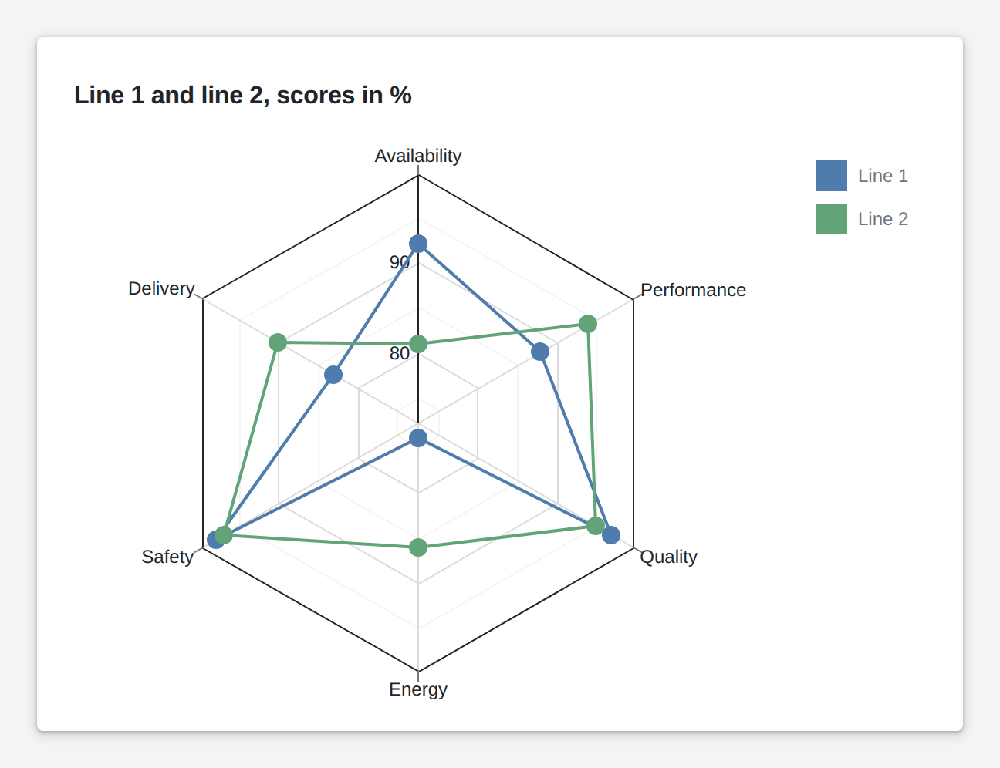

# Polar Chart

<figure><figcaption></figcaption></figure>

A polar chart plots values around a circle instead of along an axis. As a spider web it compares several scores at once, such as the scores of two lines, and shows which one is strong where. With directions as categories it becomes a wind rose. Series are drawn as lines, areas, bars or points, and a click on a point hands it to your logic.

**Good for:** comparing lines, shifts or sites on several scores, wind and direction data, cyclic patterns over a day or a week.

<!-- generated -->
<!-- Source: heisenware-cloud/packages/widgets/polar-chart. Regenerate with scripts/reference/widgets.mjs; edit outside this block only. -->

## Properties

The widget's General tab lists these properties under Receives and Emits. Drop an executor's output, input or trigger onto a row to link it. An example also fills an unlinked widget as demo data in the App Builder.



**`data`** (from an output, `Array<object>`): The rows to plot. On first bind the argument field and one series per numeric field are auto-detected (adjust them in the Content settings). Rows of primitives become `{ index, value }`.

<details>

<summary>Example</summary>

```json
[
  {
    "direction": "N",
    "speed": 14,
    "gust": 21
  },
  {
    "direction": "NE",
    "speed": 9,
    "gust": 15
  },
  {
    "direction": "E",
    "speed": 6,
    "gust": 10
  },
  {
    "direction": "SE",
    "speed": 8,
    "gust": 13
  },
  {
    "direction": "S",
    "speed": 12,
    "gust": 19
  },
  {
    "direction": "SW",
    "speed": 18,
    "gust": 27
  },
  {
    "direction": "W",
    "speed": 16,
    "gust": 24
  },
  {
    "direction": "NW",
    "speed": 11,
    "gust": 17
  }
]
```

</details>




**`onPointClick`** (into an input, `object`): Writes the clicked point as `{ argument, seriesName, value }`.





## Settings

Double-click the widget in the Page editor to open its settings, grouped in these tabs. Settings marked *set per screen* are pinned by nature: every screen keeps its own value.

<details>

<summary>Content</summary>

* **Argument field**: Field whose values are spread around the circle.
* **Series**: Series drawn in the chart, each from one value field.
  * **Name**: Name shown in the legend and tooltip.
  * **Value field**: Field that gives the series its values, plotted as distance from the center.

</details>

<details>

<summary>Look &amp; feel</summary>

* **Title**: Title shown above the chart; empty shows none.
* **Series type**: Drawing style shared by all series. Choices: Line, Area, Bar, Scatter, Stacked bar.
* **Shape**: Spider web draws straight grid lines between the arguments. Choices: Spider web, Circle.
* **Closed**: Connects each series' last point back to its first (line and area).
* **Show points**: Shows a marker at every data point.
* **Opacity**: Fill opacity of area series (0 to 1). Range 0 to 1.
* **Start angle**: Rotation in degrees; positive values rotate clockwise. Range -180 to 180.
* **Show tooltips**: Shows a popup with series, argument and value when hovering a point.
* **Palette**: Colors given to the series in order; empty keeps the default palette.

</details>

<details>

<summary>Legend</summary>

* **Visible**: Shows the legend. *Set per screen.*
* **Title**: Title shown above the legend items; empty shows none.
* **Vertical alignment**: Vertical placement of the legend block in the widget. Choices: Top, Bottom. *Set per screen.*
* **Horizontal alignment**: Horizontal placement of the legend block in the widget. Choices: Right, Center, Left. *Set per screen.*
* **Orientation**: Stacks legend items in a column or lays them in a row; empty picks a row when centered, else a column. Choices: Vertical, Horizontal. *Set per screen.*
* **Marker size**: Size of the color marker in every legend item in px. Range 10 to 40.

</details>

<!-- /generated -->
