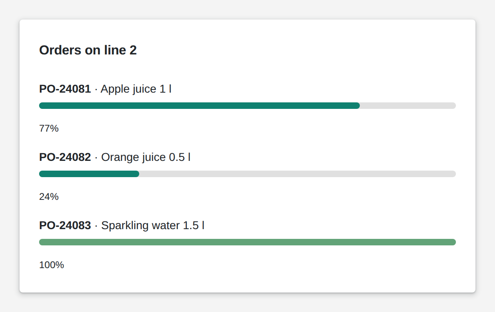

# Progress Bar

<figure><figcaption></figcaption></figure>

A progress bar fills between a minimum and a maximum and can show the percentage below. Link a count to it and set the maximum to the target, and users see how far an order, a batch or a shift has come. Your logic can change the bounds and the color on the fly, for example to green when an order is done.

**Good for:** order and batch progress, shift targets, uploads and long-running jobs.

<!-- generated -->
<!-- Source: heisenware-cloud/packages/widgets/progress. Regenerate with scripts/reference/widgets.mjs; edit outside this block only. -->

## Properties

The widget's General tab lists these properties under Receives and Emits. Drop an executor's output, input or trigger onto a row to link it. An example also fills an unlinked widget as demo data in the App Builder.



**`value`** (from an output, `number`): The current progress value (between the configured `min` and `max`).

<details>

<summary>Example</summary>

```json
67
```

</details>

**`min`** (from an output, `number`): Lower bound of the scale.

<details>

<summary>Example</summary>

```json
0
```

</details>

**`max`** (from an output, `number`): Upper bound of the scale.

<details>

<summary>Example</summary>

```json
200
```

</details>

**`showStatus`** (from an output, `boolean`): Show the percentage status text.

<details>

<summary>Example</summary>

```json
true
```

</details>

**`color`** (from an output, `string`): Any valid CSS color for the bar (overrides the configured color).

<details>

<summary>Example</summary>

```json
"#dc2828"
```

</details>

**`props`** (from an output, `object`): Facilitates setting several properties at once, e.g. `{ "min": 0, "max": 200, "showStatus": true, "color": "#dc2828" }`. The bundle wins over the individually linked channels.

<details>

<summary>Example</summary>

```json
{
  "min": 0,
  "max": 200,
  "showStatus": true
}
```

</details>





## Settings

Double-click the widget in the Page editor to open its settings, grouped in these tabs. Settings marked *set per screen* are pinned by nature: every screen keeps its own value.

<details>

<summary>Look &amp; feel</summary>

* **Minimum**: Value at which the bar is empty (0%).
* **Maximum**: Value at which the bar is full (100%).
* **Show status**: Shows the percentage text next to the bar.
* **Bar width**: Thickness of the bar in px. Range 2 to 40. *Set per screen.*
* **Color**: Fill color of the bar; empty or auto keeps the theme's accent.

</details>

<!-- /generated -->
