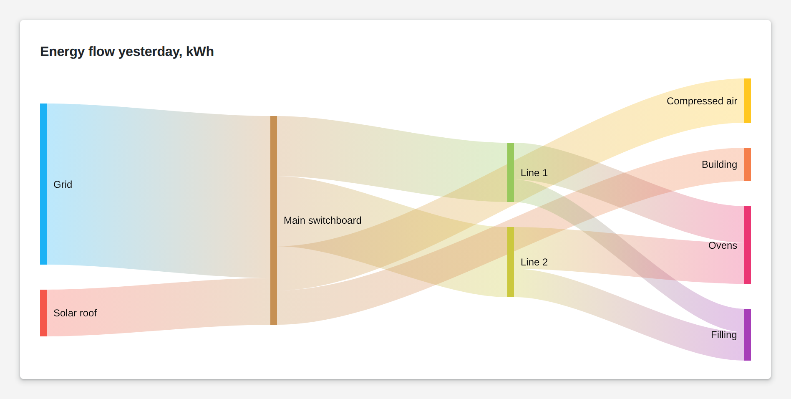

# Sankey Chart

<figure><figcaption></figcaption></figure>

A Sankey chart shows flows: where something comes from, where it goes and how much of it. The width of each band is its weight, so the big consumers and the big losses stand out at once. It takes one row per flow, with a source, a target and a weight.

**Good for:** energy and media flows, material flows through a plant, yield and loss analysis.

<!-- generated -->
<!-- Source: heisenware-cloud/packages/widgets/sankey-chart. Regenerate with scripts/reference/widgets.mjs; edit outside this block only. -->

## Properties

The widget's General tab lists these properties under Receives and Emits. Drop an executor's output, input or trigger onto a row to link it. An example also fills an unlinked widget as demo data in the App Builder.



**`data`** (from an output, `Array<object>`): The flows to plot: one object per link between two nodes.

<details>

<summary>Example</summary>

```json
[
  {
    "from": "Boiler",
    "to": "Turbine",
    "weight": 120
  },
  {
    "from": "Turbine",
    "to": "Generator",
    "weight": 95
  }
]
```

</details>





## Settings

Double-click the widget in the Page editor to open its settings, grouped in these tabs.

<details>

<summary>Look &amp; feel</summary>

* **Title**: Title shown above the diagram; empty shows none.
* **Source field**: Field naming the node a link starts from.
* **Target field**: Field naming the node a link ends at.
* **Weight field**: Field giving a link's flow amount, which sets its thickness.

</details>

<!-- /generated -->
