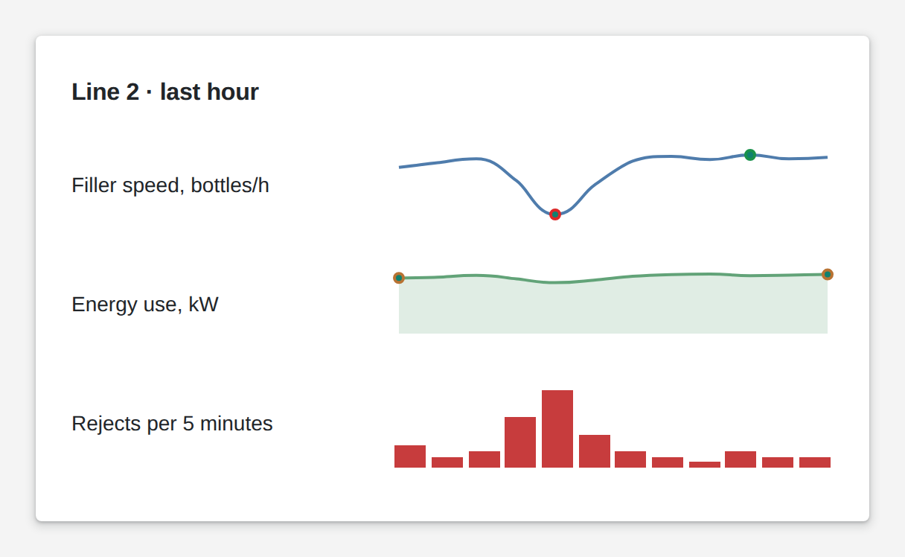

# Sparkline

<figure><figcaption></figcaption></figure>

A sparkline is a small chart without axes: it shows the shape of a trend in the space of a line of text. Draw it as a line, an area, bars or win-loss bars, and mark the minimum and maximum or the first and last point. Put one next to each figure and users see not only where a value is, but where it is heading.

**Good for:** trends next to key figures, compact machine lists, dense overview pages.

<!-- generated -->
<!-- Source: heisenware-cloud/packages/widgets/sparkline. Regenerate with scripts/reference/widgets.mjs; edit outside this block only. -->

## Properties

The widget's General tab lists these properties under Receives and Emits. Drop an executor's output, input or trigger onto a row to link it. An example also fills an unlinked widget as demo data in the App Builder.



**`data`** (from an output, `Array<object>`): The data points to plot. The argument and value fields are selected in the Data settings (auto-detected on first bind).

<details>

<summary>Example</summary>

```json
[
  {
    "t": 1,
    "v": 2.1
  },
  {
    "t": 2,
    "v": 2.6
  },
  {
    "t": 3,
    "v": 2.2
  },
  {
    "t": 4,
    "v": 3
  }
]
```

</details>





## Settings

Double-click the widget in the Page editor to open its settings, grouped in these tabs.

<details>

<summary>Content</summary>

* **Argument field**: Field that orders the points along the sparkline; empty takes the first scanned field.
* **Value field**: Field that gives the point values; empty takes the second scanned field.
* **Ignore empty points**: Connects the series across missing values instead of leaving a gap.
* **Maximum of value axis**: Top of the value axis; empty fits the data.
* **Minimum of value axis**: Bottom of the value axis; empty fits the data.

</details>

<details>

<summary>Tooltip</summary>

* **Tooltip**: Popup shown when hovering a point.
  * **Enabled**: Shows the tooltip.
  * **Interactive**: Lets members select and copy the tooltip text.
  * **Color**: Background color of the tooltip; auto keeps the theme's.
  * **arrowLength**: Length of the tooltip's arrow in px.
  * **Border radius**: Rounding of the tooltip corners in px.
  * **opacity**: Opacity of the whole tooltip, 0 (clear) to 1 (solid). Range 0 to 1.
  * **Padding left and right**: Space between the tooltip's left and right borders and its text in px.
  * **Padding top and bottom**: Space between the tooltip's top and bottom borders and its text in px.
  * **Border**: Outline of the tooltip.
    * **Color**: Color of the outline; auto keeps the theme's.
    * **Dash style**: Stroke pattern of the outline. Choices: Dashed, Dotted, Dashed long, Solid.
    * **Opacity**: Opacity of the outline, 0 (clear) to 1 (solid). Range 0 to 1.
    * **Visible**: Shows the outline.
    * **Width**: Thickness of the outline in px.
  * **Font**: Font of the tooltip text.
    * **Color**: Color of the text; auto keeps the theme's.
    * **Family**: Typeface of the text. Choices: `Arial`, `Roboto`, `Courier New`, `Georgia`, `Impact`, `Lucida Console`, `Tahoma`, `Times New Roman`, `Verdana`.
    * **Opacity**: Opacity of the text, 0 (clear) to 1 (solid). Range 0 to 1.
    * **Size**: Font size of the text in px. Choices: `8`, `10`, `12`, `14`, `18`, `24`, `36`, `48`.
    * **Weight**: Font weight of the text, 100 (thin) to 900 (black). Range 100 to 900.

</details>

<details>

<summary>Look &amp; feel</summary>

* **Type**: Drawing style of the sparkline; winloss draws every value as a bar above or below the threshold. Choices: Area, Bar, Line, Spline, Spline area, Step area, Step line, Win-Loss bar.
* **Apply customized colors**: Applies the colors chosen here; off keeps the theme's colors.
* ****: Highlight of the first and last points.
  * **Color in first and last entry**: Marks the first and last points with their own color.
  * **First and last color**: Color of the first and last point markers; auto keeps the theme's. Only when Color in first and last entry is on and customizeColors is on.
* ****: Highlight of the lowest and highest points.
  * **Color in min and max entry**: Marks the lowest and highest points with their own colors.
  * **Color of maximum**: Color of the highest point's marker; auto keeps the theme's. Only when Color in min and max entry is on.
  * **Color of minimum**: Color of the lowest point's marker; auto keeps the theme's. Only when Color in min and max entry is on.
* **Point color**: Color of the point markers; auto keeps the theme's. Only when Type is Area, Line, Spline, Spline area, Step area or Step line.
* **Point size in pixels**: Diameter of the point markers in px. Only when Type is Area, Line, Spline, Spline area, Step area or Step line.
* **Point symbol**: Shape of the point markers. Choices: `circle`, `cross`, `polygon`, `square`, `triangle`, `triangleDown`, `triangleUp`. Only when Type is Area, Line, Spline, Spline area, Step area or Step line.
* **Negative bar color**: Color of the bars below zero; auto keeps the theme's. Only when Type is Bar.
* **Positive bar color**: Color of the bars above zero; auto keeps the theme's. Only when Type is Bar.
* **Line color**: Color of the line; auto keeps the theme's. Only when Type is Area, Line, Spline, Spline area, Step area or Step line.
* **Line width**: Thickness of the line in px. Only when Type is Area, Line, Spline, Spline area, Step area or Step line.
* **Win color**: Color of the bars above the win-loss threshold; auto keeps the theme's. Only when Type is Win-Loss bar.
* **Loss color**: Color of the bars below the win-loss threshold; auto keeps the theme's. Only when Type is Win-Loss bar.
* **Win-Loss threshold**: Set the value that divides wins from losses. Only when Type is Win-Loss bar.

</details>

<!-- /generated -->
