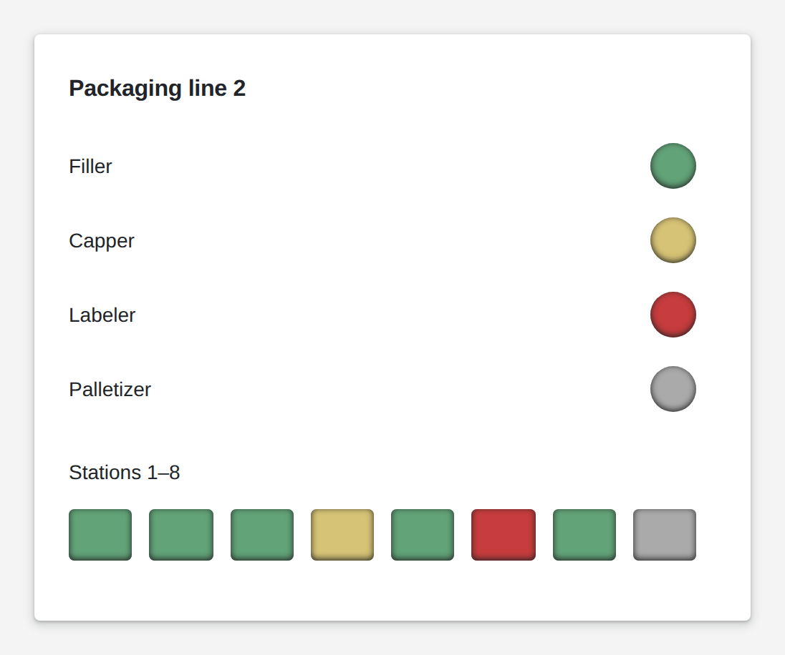

# Status Lamp

<figure><figcaption></figcaption></figure>

A status lamp shows a state at a glance: running, setup, fault, idle, or whatever states your machines know. You decide which value lights which color. Link it to an executor's status and it tells whether that executor can run. Give it a list of states and the rectangle shape turns it into a strip, one bar per state, so a whole line fits in one row. A click can hand a value back to your logic, for example to open the machine's detail page.

**Good for:** machine and line overviews, connection health, alarm boards.

<!-- generated -->
<!-- Source: heisenware-cloud/packages/widgets/status-lamp. Regenerate with scripts/reference/widgets.mjs; edit outside this block only. -->

## Properties

The widget's General tab lists these properties under Receives and Emits. Drop an executor's output, input or trigger onto a row to link it. An example also fills an unlinked widget as demo data in the App Builder.



**`value`** (from an output, `string | Array<string>`): A single state, or an array of those.

<details>

<summary>Example</summary>

```json
"running"
```

</details>

**`color`** (from an output, `string | Array<string>`): The direct color that should be applied to the lamp.

<details>

<summary>Example</summary>

```json
"#19914b"
```

</details>

**`context`** (from an output, `any`): Any context that will be provided back, when clicked.

<details>

<summary>Example</summary>

```json
{
  "device": "Pump A"
}
```

</details>

**`value`** (from an executor's status, `string`): The linked executor's status drives the lamp state.

<details>

<summary>Example</summary>

```json
"ok"
```

</details>




**`onClick`** (into an input): Writes the bound context value when the lamp is clicked.





## Settings

Double-click the widget in the Page editor to open its settings, grouped in these tabs. Settings marked *set per screen* are pinned by nature: every screen keeps its own value.

<details>

<summary>Look &amp; feel</summary>

* **Shape**: circle draws round lamps sized to the short side; rectangle splits the long side into rounded bars. Choices: `circle`, `rectangle`.
* **Status mappings**: Colors by status: a bound value is matched against these entries; no match shows a dim grey lamp.
  * **Value**: Status this entry matches, compared as text; an object is matched by its status field.
  * **Color**: Lamp color for this status; transparent hides the lamp, empty or auto keeps the theme's.
* **Context**: Value sent with the click to the linked input; a bound context replaces it.
* **Spacing**: Gap between the bars in px when several states show in rectangle shape. *Set per screen.*

</details>

<!-- /generated -->
