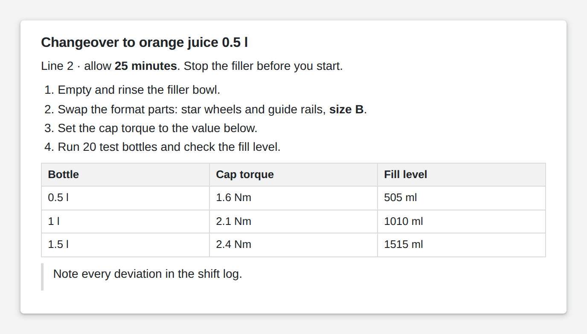

# Text

<figure><figcaption></figcaption></figure>

A text box holds the fixed text of a page: titles, labels, instructions, small tables. You write it in Markdown, so headings, bold words, lists, tables, quotes and links take a few keystrokes, and the App's theme styles them. A text box shows no live values; for those use a value box or another display widget.

**Good for:** page titles and labels, work instructions, notes and help texts next to inputs.

<!-- generated -->
<!-- Source: heisenware-cloud/packages/widgets/text. Regenerate with scripts/reference/widgets.mjs; edit outside this block only. -->

## Settings

Double-click the widget in the Page editor to open its settings, grouped in these tabs.

Content

* **Text**: The text: markdown (headings, lists, tables, quotes, code, links) or HTML. Titles, labels, instructions, static tables - pictures belong to the image widget.

Look &amp; feel

* **Vertical alignment**: Where the text sits within the box height when it is shorter than the box. Choices: Top, Center, Bottom.

<!-- /generated -->
