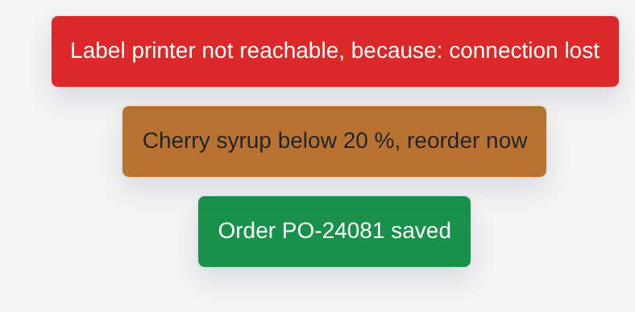

# Toast

<figure><figcaption></figcaption></figure>

A toast pops up a short message and fades away again: a success, a warning, an error or an info. Each value it receives becomes one toast, so your logic can report what happened, such as a saved order or a low tank. Link it to an executor's error handler, and every error of that executor reaches users as a toast with its cause. The toast itself takes no place on the page.

**Good for:** confirmations after saving, warnings about limits, showing errors to users.

<!-- generated -->
<!-- Source: heisenware-cloud/packages/widgets/toast. Regenerate with scripts/reference/widgets.mjs; edit outside this block only. -->

## Properties

The widget's General tab lists these properties under Receives and Emits. Drop an executor's output, input or trigger onto a row to link it. An example also fills an unlinked widget as demo data in the App Builder.



**`message`** (from an output, `string | object`): Shows a toast once per received value. Strings display as-is; objects display as `message` (plus `, because: <cause>` when present).

<details>

<summary>Example</summary>

```json
"Order saved"
```

</details>

**`message`** (from an error handler, `object`): Receives the linked executor's error and shows it as a toast: `<message>, because: <cause>`.

<details>

<summary>Example</summary>

```json
{
  "message": "Saving failed",
  "cause": "connection lost"
}
```

</details>





## Settings

Double-click the widget in the Page editor to open its settings, grouped in these tabs. Settings marked *set per screen* are pinned by nature: every screen keeps its own value.

<details>

<summary>Look &amp; feel</summary>

* **Type**: Color and icon of the notification: info grey, warning yellow, error red, success green. Choices: Info, Warning, Error, Success.
* **Display time**: How long the notification stays on screen in ms. Range 100 to 10000.
* **Position**: Edge or corner of the screen where the notification appears. Choices: Bottom left, Bottom center, Bottom right, Top left, Top center, Top right. *Set per screen.*

</details>

<!-- /generated -->
