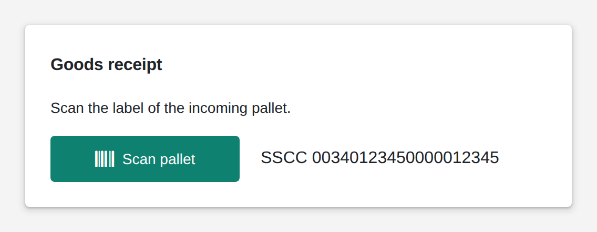

# Barcode / QR

<figure><figcaption></figcaption></figure>

The barcode widget is a scan button: a tap opens the device camera, and the code it reads goes to your logic as text. It reads barcodes and QR codes. In single mode one scan finishes the job; in multiple mode users scan several codes in a row and save them as a list. Your logic can clear the scans and restyle the button.

**Good for:** goods receipt and picking, identifying machines, containers and batches, quick lookups on the shop floor.

<!-- generated -->
<!-- Source: heisenware-cloud/packages/widgets/barcode. Regenerate with scripts/reference/widgets.mjs; edit outside this block only. -->

## Properties

The widget's General tab lists these properties under Receives and Emits. Drop an executor's output, input or trigger onto a row to link it. An example also fills an unlinked widget as demo data in the App Builder.



**`clear`** (from an output, `any`): Clears all captured barcodes on truthy values.

<details>

<summary>Example</summary>

```json
true
```

</details>

**`button`** (from an output, `object`): Configures the scan button.

<details>

<summary>Example</summary>

```json
{
  "text": "Scan now",
  "type": "success",
  "stylingMode": "contained"
}
```

</details>




**`text`** (into an input, `string | Array<string>`): The scanned result: a single barcode text in `single` scan mode, or an array of all captured texts when saving in `multiple` mode. Writes `''` when cleared.





## Settings

Double-click the widget in the Page editor to open its settings, grouped in these tabs. Settings marked *set per screen* are pinned by nature: every screen keeps its own value.

<details>

<summary>Look &amp; feel</summary>

* **Scan mode**: Single writes the first code read and closes the camera; multiple collects codes until the check button writes them as an array. Choices: Single, Multiple.
* **button**: The button members press to scan, upload or take a photo.
  * **Button Text**: Label shown on the button; empty shows none.
  * **Icon**: Font Awesome class of an icon shown left of the label, e.g. fa-light fa-camera; empty shows none.
  * **Text Size**: Font size of the label in px. Range 8 to 40. *Set per screen.*
  * **Icon Size**: Size of the icon in px. Range 20 to 100. *Set per screen.*
  * **Button Type**: Color scheme: default uses the accent color, normal is neutral, success green, danger red. Choices: `default`, `normal`, `success`, `danger`.
  * **Styling Mode**: Contained fills the button with its color, outlined draws only a border, text shows the label alone. Choices: `text`, `contained`, `outlined`.
  * **Hover Text**: Tooltip shown while the pointer rests on the button; empty shows the label or nothing.
  * **Initially Disabled**: Starts the button greyed out and unclickable until a bound button value enables it.

</details>

<!-- /generated -->
