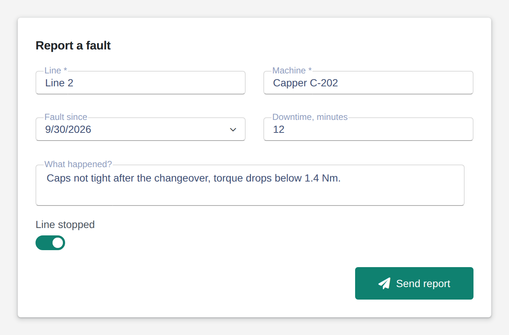

# Form

<figure><figcaption></figcaption></figure>

A form collects structured input: text, numbers, dates, dropdowns, tags, switches, sliders and more, laid out in columns, sections or tabs. Every edit goes to your logic as one object, the form data, so a button next to the form only has to send it on. Fields can be required and are validated on request. Your logic can prefill the form, fill its dropdowns, add fields on the fly or lock the whole form.

**Good for:** fault and quality reports, order entry, settings and recipes, checklists.

<!-- generated -->
<!-- Source: heisenware-cloud/packages/widgets/form. Regenerate with scripts/reference/widgets.mjs; edit outside this block only. -->

## Properties

The widget's General tab lists these properties under Receives and Emits. Drop an executor's output, input or trigger onto a row to link it. An example also fills an unlinked widget as demo data in the App Builder.



**`autoFill`** (from an output, `object`): Merges the received object into the form data (writes `formData` back when `triggerFormDataOnAutoFill` is set).

<details>

<summary>Example</summary>

```json
{
  "operator": "J. Smith",
  "shift": "night"
}
```

</details>

**`options`** (from an output, `object`): Provides select-box options per field at runtime, overriding the statically configured options.

<details>

<summary>Example</summary>

```json
{
  "line": [
    "Line 1",
    "Line 2",
    "Line 3"
  ]
}
```

</details>

**`clear`** (from an output, `any`): Truthy values clear the form (and write back an empty `formData`).

<details>

<summary>Example</summary>

```json
true
```

</details>

**`validate`** (from an output, `any`): Truthy values run validation and write the outcome to `validationResult`.

<details>

<summary>Example</summary>

```json
true
```

</details>

**`readOnly`** (from an output, `any`): Truthy makes the whole form read-only, falsy editable again.

<details>

<summary>Example</summary>

```json
true
```

</details>

**`addFields`** (from an output, `Array<object> | object`): Appends dynamic fields: an array of field configurations (same shape as the Content settings' fields), or an object of `{ <dataField>: <field config> }`.

<details>

<summary>Example</summary>

```json
[
  {
    "dataField": "notes",
    "label": "Notes",
    "widget": "text"
  }
]
```

</details>

**`setFields`** (from an output, `Array<object>`): Replaces the dynamic fields with the received array of field configurations (same shape as the Content settings' fields).

<details>

<summary>Example</summary>

```json
[
  {
    "dataField": "batchId",
    "label": "Batch",
    "widget": "text"
  }
]
```

</details>




**`formData`** (into an input, `object`): Writes the complete form data on every edit (and `{}` after clear). Nested field paths become nested objects.

**`validationResult`** (into an input, `object`): Writes the outcome after the `validate` command ran.





## Settings

Double-click the widget in the Page editor to open its settings, grouped in these tabs. Settings marked *set per screen* are pinned by nature: every screen keeps its own value.

<details>

<summary>Content</summary>

* **Forms**: Field groups of the form: one group renders flat, several render as captioned sections, or as tabs when they share a tab label.
  * **Fields**: Fields of the group, in this order.
    * **Data field**: Key of the value in formData.
    * **Label**: Label shown for the field; empty shows none.
    * **Help text**: Hint shown under the field; empty shows none.
    * **Column span**: Columns the field spans (see column count); a text area always spans 2.
    * **Required**: Marks the field required (asterisk on the label); validation fails while it is empty.
    * **Disabled**: Greys the editor out; members cannot change it.
    * **Read only**: Shows the value without letting members change it.
    * **Editor type**: Kind of input shown for the field. Choices: Text box, Select box, Number box, Check box, Password, Tag box, Date/Time select, Date range select, Color select, Location select, Radio group, Text area, Slider, Switch, Calendar, Native agent.
    * **Use accent color**: Colors the value with the theme's primary color while the form is read-only. Only when Editor type is Text box.
    * **Minimum**: Lowest value the editor accepts; empty sets no limit. Only when Editor type is Number box.
    * **Maximum**: Highest value the editor accepts; empty sets no limit. Only when Editor type is Number box.
    * **Default value**: Value the field starts with, also after clear, until formData or the user sets it; empty starts blank. Only when Editor type is Number box.
    * **Prefix**: Text placed before the number, such as a currency sign; empty adds none. Only when Editor type is Number box.
    * **Suffix**: Text placed after the number, such as a unit; empty adds none. Only when Editor type is Number box.
    * **Show separator**: Groups thousands with a separator (1,234,567). Only when Editor type is Number box.
    * **Precision**: Decimal places allowed in the number; empty shows whole numbers when a prefix, suffix or separator is set, else the number as typed. Only when Editor type is Number box.
    * **Step**: Distance between two slider positions. Only when Editor type is Slider.
    * **Date type**: Kind of value the picker edits: a date, a time of day or both. Choices: Date only, Time only, Date & time. Only when Editor type is Date/Time select.
    * **Options**: Options offered by the picker, comma separated. Only when Editor type is Select box.
    * **Enable searching**: Lets members type to filter the options. Only when Editor type is Select box.
    * **Show clear button**: Adds a button that clears the selection. Only when Editor type is Select box.
    * **Show drop down button**: Shows the arrow that opens the list. Only when Editor type is Select box.
    * **Switched on text**: Text shown on the switch while it is on. Only when Editor type is Switch.
    * **Switched off text**: Text shown on the switch while it is off. Only when Editor type is Switch.
    * **layout**: Stacks the options vertically or lays them out in a row. Choices: Vertical, Horizontal. Only when Editor type is Radio group.
    * **Location type**: What the Google Places lookup completes: address a street address, establishment a named place with its address. Choices: Full address, Place. Only when Editor type is Location select.

</details>

<details>

<summary>Look &amp; feel</summary>

* **Column count**: Columns the fields are laid out in: 1 stacks them, auto fits as many as the width allows. Choices: `auto`, `1`, `2`, `3`, `4`, `5`, `6`. *Set per screen.*
* **Label location**: Where a field's label sits: left of, right of or above its editor. Choices: `left`, `right`, `top`. *Set per screen.*
* **Label mode**: Static: label beside the value. Floating: label inside the editor, rising once it holds a value. Hidden: no label. Outside: label outside the editor box. Choices: Static, Floating, Hidden, Outside. *Set per screen.*
* **Custom content size**: Font size of the values in px; empty keeps the theme's. Range 6 to 50. *Set per screen.*
* **Custom label size**: Font size of the labels in px; empty keeps the theme's. Range 6 to 50. *Set per screen.*
* **Show colon**: Puts a colon after every label.
* **Initially readonly**: Starts the form read-only until the readOnly input switches it.
* **Trigger formData event on autofill**: Emits formData after an autofill and lets a linked formData apply while autoFill is linked; off, an autofill only fills the editors.

</details>

<!-- /generated -->
