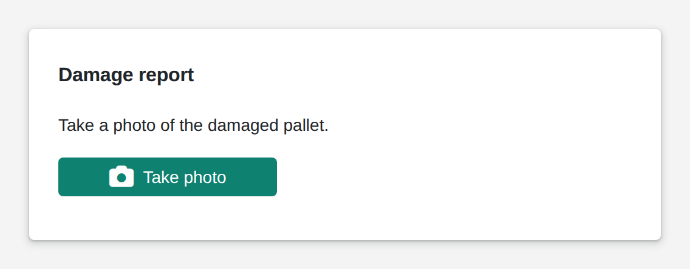

# Photo

<figure><figcaption></figcaption></figure>

The photo widget takes pictures with the device camera, cropped to a fixed aspect ratio and in the quality you choose. After each picture, the full list of photos goes to your logic, which can store them or attach them to a record. For new Apps, use the upload widget instead: it takes photos as well as files, and it replaces this widget.

**Good for:** damage and quality photos in existing Apps.

<!-- generated -->
<!-- Source: heisenware-cloud/packages/widgets/photo. Regenerate with scripts/reference/widgets.mjs; edit outside this block only. -->

## Properties

The widget's General tab lists these properties under Receives and Emits. Drop an executor's output, input or trigger onto a row to link it. An example also fills an unlinked widget as demo data in the App Builder.



**`images`** (into an input, `Array<object>`): Writes the full list of captured photos after every capture or delete.

**`onClick`** (fires a trigger): Triggers the linked executor when a photo is captured.





## Settings

Double-click the widget in the Page editor to open its settings, grouped in these tabs. Settings marked *set per screen* are pinned by nature: every screen keeps its own value.

Look &amp; feel

* **Storage type**: File uploads each photo as JPEG to the server and delivers a path; buffer keeps it in the value as base64. Choices: File, Buffer.
* **button**: The button members press to scan, upload or take a photo.
  * **Button Text**: Label shown on the button; empty shows none.
  * **Icon**: Font Awesome class of an icon shown left of the label, e.g. fa-light fa-camera; empty shows none.
  * **Text Size**: Font size of the label in px. Range 8 to 40. *Set per screen.*
  * **Icon Size**: Size of the icon in px. Range 20 to 100. *Set per screen.*
  * **Button Type**: Color scheme: default uses the accent color, normal is neutral, success green, danger red. Choices: `default`, `normal`, `success`, `danger`.
  * **Styling Mode**: Contained fills the button with its color, outlined draws only a border, text shows the label alone. Choices: `text`, `contained`, `outlined`.
  * **Hover Text**: Tooltip shown while the pointer rests on the button; empty shows the label or nothing.
  * **Initially Disabled**: Starts the button greyed out and unclickable until a bound button value enables it.
* **Aspect ratio**: Width-to-height ratio of the crop frame over the camera view; portrait orientation flips it. Choices: 16/9, 4/3, 7/5 (DIN A4).
* **Resolution**: JPEG quality of the saved photo: low 50%, medium 80%, high 100%; the camera stream is always asked for 1920x1080. Choices: Low, Medium, High.
* **Orientation**: Portrait makes the crop frame taller than wide, landscape wider than tall. Choices: Portrait, Landscape.
* **Maximum number of photos**: Number of photos the widget holds; the button disables once reached.
* **Thumbnail size**: Height of the preview thumbnails. Range 40 to 400. *Set per screen.*

<!-- /generated -->
