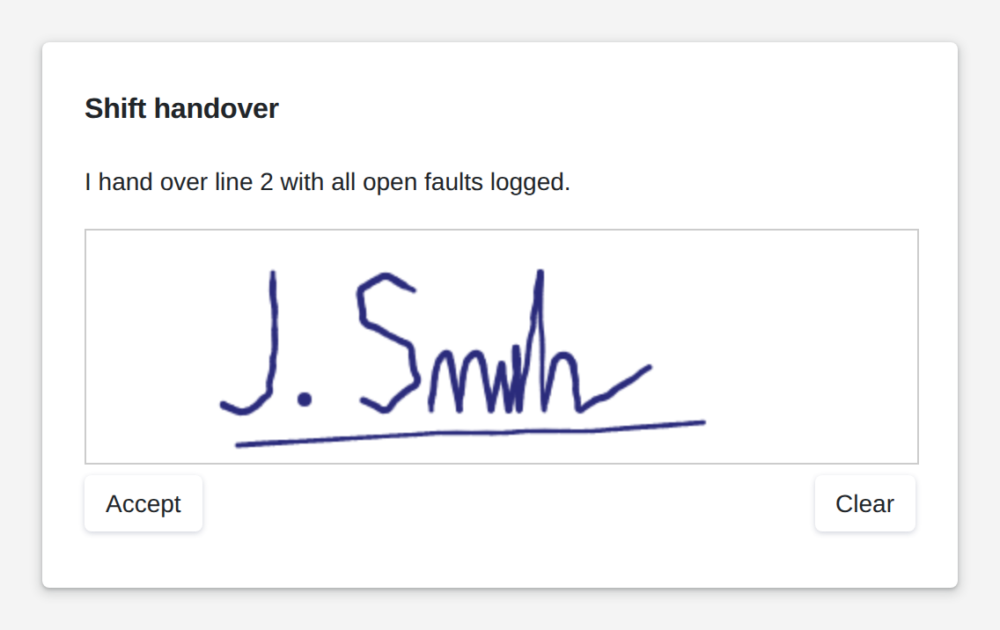

# Signature

<figure><figcaption></figcaption></figure>

The signature widget lets users sign with a finger, a pen or the mouse, right on the page or in a popup. When they accept, the signature goes to your logic as a PNG image, ready to be stored with the record or printed into a report. You choose the pen and pad colors and the button texts.

**Good for:** shift handovers, delivery and acceptance notes, approvals and sign-offs.

<!-- generated -->
<!-- Source: heisenware-cloud/packages/widgets/signature. Regenerate with scripts/reference/widgets.mjs; edit outside this block only. -->

## Properties

The widget's General tab lists these properties under Receives and Emits. Drop an executor's output, input or trigger onto a row to link it. An example also fills an unlinked widget as demo data in the App Builder.



**`signature`** (into an input, `string`): Writes the captured signature as a base64-encoded PNG (no data-URL prefix) when the user accepts it.

**`onClick`** (fires a trigger): Triggers the linked executor when a signature is accepted.





## Settings

Double-click the widget in the Page editor to open its settings, grouped in these tabs.

Look &amp; feel

* **Pen color**: Color of the drawn stroke; auto keeps the theme's text color.
* **Pad color**: Background color of the signing pad; auto keeps the theme's tile color.
* **Display mode**: Popup shows a button that opens the signing pad in a dialog; inline draws the pad in the widget itself with its buttons below. Choices: Inline, Popup.
* **Accept text**: Label of the pad button that delivers the signature and closes the dialog; ignored while the pad is empty.
* **Clear text**: Label of the pad button that wipes the drawing.
* **Button text**: Label of the button on the page, also the title of the dialog. Only when Display mode is Popup.

<!-- /generated -->
