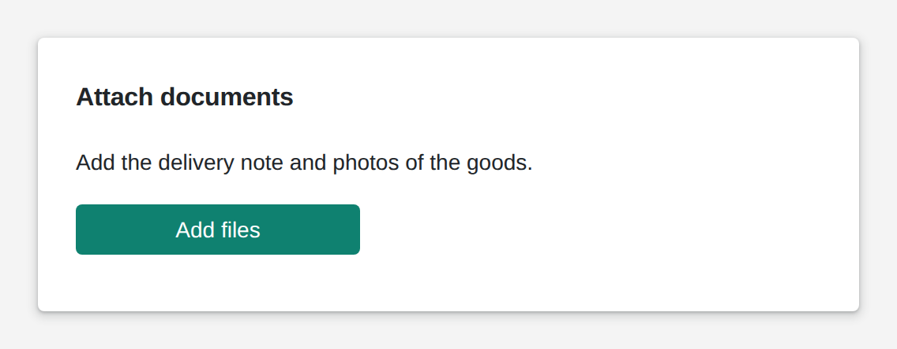

# Upload

<figure><figcaption></figcaption></figure>

The upload widget lets users add files: from the file picker, or on phones and tablets straight from the camera. You decide which file types it takes and how many, and it can show thumbnails of what was added. After every change, the list of files goes to your logic, as paths on the file server or as the file content itself.

**Good for:** delivery notes and certificates, photos for damage or quality reports, importing lists and recipes.

<!-- generated -->
<!-- Source: heisenware-cloud/packages/widgets/file. Regenerate with scripts/reference/widgets.mjs; edit outside this block only. -->

## Properties

The widget's General tab lists these properties under Receives and Emits. Drop an executor's output, input or trigger onto a row to link it. An example also fills an unlinked widget as demo data in the App Builder.



**`clear`** (from an output, `any`): Truthy values clear the file list (and write back an empty array).

<details>

<summary>Example</summary>

```json
true
```

</details>




**`files`** (into an input, `Array<object>`): Writes the full list of selected/uploaded files after every add or delete (an empty array when cleared).





## Settings

Double-click the widget in the Page editor to open its settings, grouped in these tabs. Settings marked *set per screen* are pinned by nature: every screen keeps its own value.

<details>

<summary>Look &amp; feel</summary>

* **Storage type**: File uploads to the server and delivers a path; buffer keeps the content in the value as base64. Choices: File, Buffer.
* **button**: The button members press to scan, upload or take a photo.
  * **Button Text**: Label shown on the button; empty shows none.
  * **Icon**: Font Awesome class of an icon shown left of the label, e.g. fa-light fa-camera; empty shows none.
  * **Text Size**: Font size of the label in px. Range 8 to 40. *Set per screen.*
  * **Icon Size**: Size of the icon in px. Range 20 to 100. *Set per screen.*
  * **Button Type**: Color scheme: default uses the accent color, normal is neutral, success green, danger red. Choices: `default`, `normal`, `success`, `danger`.
  * **Styling Mode**: Contained fills the button with its color, outlined draws only a border, text shows the label alone. Choices: `text`, `contained`, `outlined`.
  * **Hover Text**: Tooltip shown while the pointer rests on the button; empty shows the label or nothing.
  * **Initially Disabled**: Starts the button greyed out and unclickable until a bound button value enables it.
* **restrictions**: Limits on the files members may add.
  * **Allowed file types**: File categories the picker allows; empty allows every category. On phones and tablets Photo adds the camera, or alone replaces the picker with it. Choices: `Photo`, `Text`, `Documents`, `Spreadsheets`, `Presentations`, `Images`, `Audio`, `Video`, `Archives`, `Web`.
  * **Maximum number of files**: Number of files the widget holds; the button disables once reached.
  * **Aspect ratio**: Crops every added image to this width-to-height ratio, centered; original keeps the picture as it is. Choices: Original, 16/9, 4/3, 7/5 (DIN A4).
  * **Resolution**: Shrinks every added image to a longest side of 640 (preview), 1920 (balanced) or 2560 px (high), re-encoded as JPEG; original keeps it. Choices: Original, Preview, Balanced, High.
* **Allow multi-file upload**: Lets the picker take several files in one go; the camera always takes one.
* **Show thumbnails**: Shows a preview picture for each file in the list instead of its name and size. *Set per screen.*
* **Thumbnail size**: Height of the preview thumbnails in px. Range 40 to 400. *Set per screen.*

</details>

<!-- /generated -->
