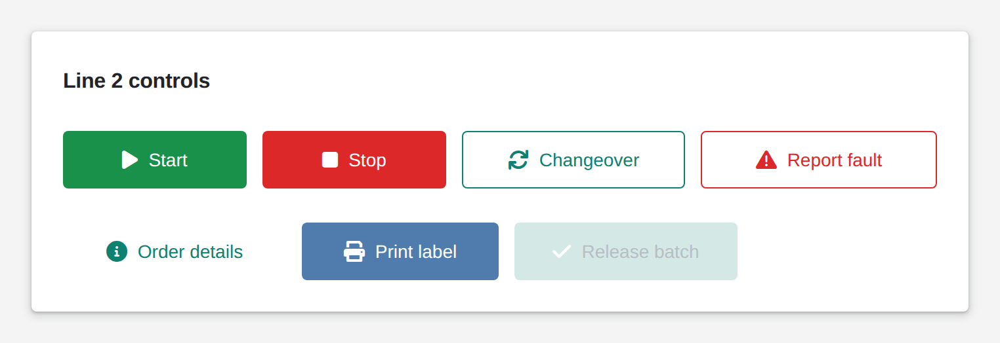

# Button

<figure><figcaption></figcaption></figure>

A button is how users make things happen: a click runs your logic, switches to another page, or runs an App action such as logout. Pick a type (success, danger, normal), a style (filled, outlined, text only), a color and an icon. A button can ask for confirmation before it acts, and it can show a spinner until your logic reports back. Your logic can also disable a button, relabel it or change its color, for example when a batch is not ready for release.

**Good for:** starting and stopping machines, confirming steps, saving forms, moving between pages.

<!-- generated -->
<!-- Source: heisenware-cloud/packages/widgets/button. Regenerate with scripts/reference/widgets.mjs; edit outside this block only. -->

## Properties

The widget's General tab lists these properties under Receives and Emits. Drop an executor's output, input or trigger onto a row to link it. An example also fills an unlinked widget as demo data in the App Builder.



**`disable`** (from an output, `any`): When truthy, the button gets disabled. Falsy values are ignored.

<details>

<summary>Example</summary>

```json
true
```

</details>

**`enable`** (from an output, `any`): When truthy, the button gets enabled. Falsy values are ignored.

<details>

<summary>Example</summary>

```json
true
```

</details>

**`toggle`** (from an output, `any`): When truthy, the button is enabled, when falsy it is disabled.

<details>

<summary>Example</summary>

```json
true
```

</details>

**`disabled`** (from an output, `any`): When truthy, the button is disabled, when falsy it is enabled.

<details>

<summary>Example</summary>

```json
true
```

</details>

**`done`** (from an output, `any`): When linked, the button plays a loading animation until a value update is received.

<details>

<summary>Example</summary>

```json
true
```

</details>

**`text`** (from an output, `string`): The button's text.

<details>

<summary>Example</summary>

```json
"Start pump"
```

</details>

**`fontSize`** (from an output, `integer`): The size of the button's text.

<details>

<summary>Example</summary>

```json
16
```

</details>

**`iconSize`** (from an output, `integer`): The size of the button's icon.

<details>

<summary>Example</summary>

```json
22
```

</details>

**`type`** (from an output, `'default' | 'normal' | 'success' | 'danger'`): The type of the button.

<details>

<summary>Example</summary>

```json
"success"
```

</details>

**`stylingMode`** (from an output, `'text' | 'contained' | 'outlined'`): The styling mode of the button.

<details>

<summary>Example</summary>

```json
"outlined"
```

</details>

**`color`** (from an output, `string`): Any valid CSS color for the button (overrides the configured color); `auto` restores the color the type gives.

<details>

<summary>Example</summary>

```json
"#dc2828"
```

</details>




**`onClick`** (into an input): Fires the linked executor when the button is clicked (no value is written).

**`onClick`** (fires a trigger): Triggers the linked executor when the button is clicked.

**`onClick`** (switches to a page): Switches to the linked page when the button is clicked.

**`onClick`** (runs an App action): Runs the linked app action (logout, reload, back) when the button is clicked.





## Settings

Double-click the widget in the Page editor to open its settings, grouped in these tabs. Settings marked *set per screen* are pinned by nature: every screen keeps its own value.

<details>

<summary>Look &amp; feel</summary>

* **Button text**: Label shown on the button; empty shows only the icon. An input link receives it on click.
* **Icon**: Font Awesome class of an icon shown left of the label, e.g. fa-light fa-play; empty shows none.
* **Font size**: Font size of the label in px. Range 14 to 100. *Set per screen.*
* **Icon size**: Size of the icon in px. Range 20 to 100. *Set per screen.*
* **Type**: Color scheme: default accent, normal neutral, success green, danger red; transparent makes it an invisible click area. Choices: `default`, `normal`, `success`, `danger`, `transparent`.
* **Styling mode**: Contained fills the button with its color, outlined draws only a border, text shows the label alone; transparent ignores it. Choices: `text`, `contained`, `outlined`.
* **Color**: Custom button color; auto keeps the color the type gives.
* **Hover text**: Tooltip shown while the pointer rests on the button; empty shows none.
* **Initially disabled**: Starts the button greyed out and unclickable until a bound enable, toggle or disabled value changes it.
* **Requires confirmation**: Asks for confirmation in a dialog before the click fires; cancelling does nothing.
* **Confirmation title**: Heading of the confirmation dialog; empty shows none. Only when Requires confirmation is on.
* **Confirmation text**: Question shown in the confirmation dialog. Only when Requires confirmation is on.

</details>

## Good to know

* Drag a page or an App action from the Pages and actions explorer onto it to run it on click.

<!-- /generated -->
