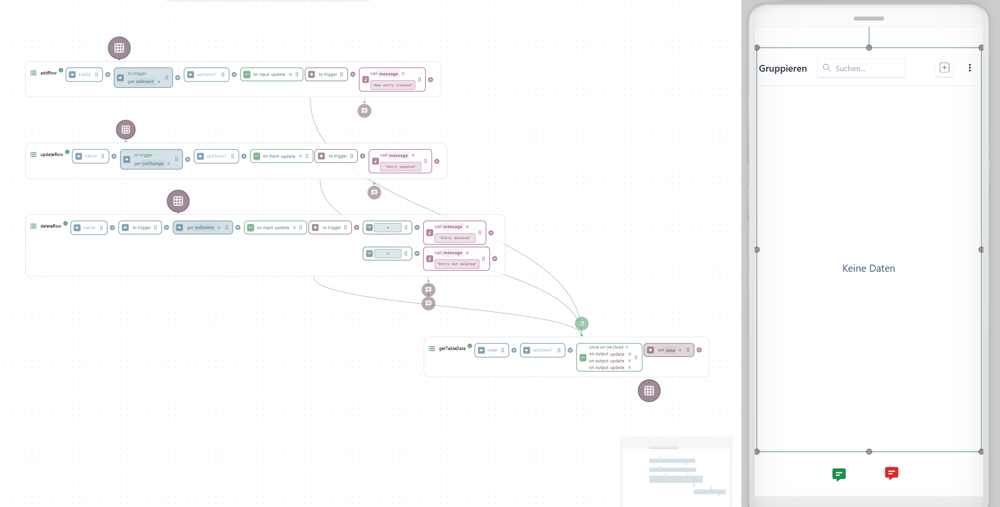

# CRUD Operations with the Data Grid

You can connect a [data grid widget](../../app-builder/build-frontend/widgets/display-widgets/data-grid.md) to a table (from [internal Postgres / external SQL database](../../app-builder/build-backend/function-explorer/storage/relational-database.md)) to perform create, read, update, and delete (CRUD) operations directly from the UI. The provided template contains all necessary widget bindings, logic functions, and UI feedback configurations out of the box.

Reference videos: [Part 1](crud-operations-with-the-data-grid.md#part-1-data-grid-widget-and-crud-operations) | [Part 2](crud-operations-with-the-data-grid.md#part-2-toast-widget-configuration)

## Step-by-Step Guide



#### Download the example template

Download the `data-grid-crud.hwt` template file to your local machine.





#### Import the template

1. Open the App Builder.
2. Click on the [versioning tags](../../app-builder/deploy-and-maintain.md#versioning-tags-snapshots) menu.
3. Select Import and upload the `data-grid-crud.hwt` file.
4. Select the imported template and confirm the switch in the popup dialog.



#### Configure the data source

Because the template handles the logic and data bindings, you only need to define your target table (e.g., a `maintenanceTasks` table) and ensure your database is accessible.

1. Select each Function and update the table name parameter to match your specific table.
2. Verify your database connection. If using an external SQL database, ensure the connection is active.
3. If you are starting from scratch and do not have an existing table, you can execute the [`defineTable`](../../app-builder/build-backend/function-explorer/storage/relational-database.md#definetable) and [`addRows`](../../app-builder/build-backend/function-explorer/storage/relational-database.md#addrows) Functions once to initialize the schema and write the initial records.



## Template Architecture

While the template is plug-and-play, understanding the underlying wiring is necessary if you plan to adapt it for more complex requirements.

<figure><figcaption></figcaption></figure>

* **Data population:** The data output of the [`getTableData`](../../app-builder/build-backend/function-explorer/storage/relational-database.md#gettabledata) Function binds directly to the data property of the data grid widget to populate the UI.
* **Data grid interactions:** Users interact exclusively with the data grid UI. The grid's native `onInsert`, `onUpdate`, and `onDelete` events bind directly to the inputs of the [`addRow`](../../app-builder/build-backend/function-explorer/storage/relational-database.md#addrow), [`updateRow`](../../app-builder/build-backend/function-explorer/storage/relational-database.md#updaterow), and [`deleteRow`](../../app-builder/build-backend/function-explorer/storage/relational-database.md#deleterow) Functions.
* **User feedback:** [Modifiers](../../app-builder/build-backend/modifier.md) trigger on the execution of the CRUD Functions and pass adjustable strings to a [toast widget](../../app-builder/build-frontend/widgets/display-widgets/toast.md) to display immediate confirmation or error messages to the operator.

## Reference Videos

### Part 1: Data Grid Widget and CRUD Operations



### Part 2: Toast Widget configuration


