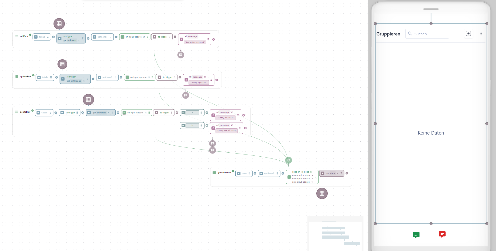

# CRUD operations with the data grid

Connect a [data grid](../../app-builder/build-frontend/widgets/display-widgets/data-grid.md) widget to a table from a [relational database](../../app-builder/build-backend/functions/storage/relational-database.md) (either an internal Postgres or external SQL database) to perform create, read, update, and delete (CRUD) operations directly from the UI. The provided template contains all necessary widget bindings, logic functions, and UI feedback configurations out of the box.

Reference videos: [Part 1](#part-1-data-grid-widget-and-crud-operations) | [Part 2](#part-2-toast-widget-configuration)

## Step-by-step guide



#### Download the example template

Download the `data-grid-crud.hwt` template file to your computer.





#### Import the template

1. Open the **App Builder**.
2. Click the tags menu (see [Deploy and maintain](../../app-builder/deploy-and-maintain.md)).
3. Select import and upload the `data-grid-crud.hwt` file.
4. Select the imported template and confirm the switch in the popup dialog.



#### Configure the data source

The template handles the logic and data bindings automatically. You only need to define your target table (such as a `maintenanceTasks` table) and ensure your database is accessible.

1. Select each function and update the table name parameter to match your specific table.
2. Verify your database connection. If you use an external SQL database, ensure the connection is active.
3. If you do not have an existing table, run the [`defineTable`](../../app-builder/build-backend/functions/storage/relational-database.md#definetable) and [`addRows`](../../app-builder/build-backend/functions/storage/relational-database.md#addrows) functions once to initialize the schema and write the initial records.



## Template architecture

Understand the underlying wiring to adapt the template for more complex requirements.

<figure><figcaption></figcaption></figure>

* **Data population:** The output of the [`getTableData`](../../app-builder/build-backend/functions/storage/relational-database.md#gettabledata) function binds directly to the data property of the [data grid](../../app-builder/build-frontend/widgets/display-widgets/data-grid.md) widget to populate the UI.
* **Data grid interactions:** Users interact directly with the [data grid](../../app-builder/build-frontend/widgets/display-widgets/data-grid.md). The widget's native `onInsert`, `onUpdate`, and `onDelete` events bind directly to the inputs of the [`addRow`](../../app-builder/build-backend/functions/storage/relational-database.md#addrow), [`updateRow`](../../app-builder/build-backend/functions/storage/relational-database.md#updaterow), and [`deleteRow`](../../app-builder/build-backend/functions/storage/relational-database.md#deleterow) functions.
* **User feedback:** [Modifiers](../../app-builder/build-backend/extension-nodes/modifier.md) trigger when CRUD functions execute, passing customizable strings to a [toast](../../app-builder/build-frontend/widgets/display-widgets/toast.md) widget to display immediate confirmation or error messages.

## Reference videos

### Part 1: data grid widget and CRUD operations



### Part 2: toast widget configuration


